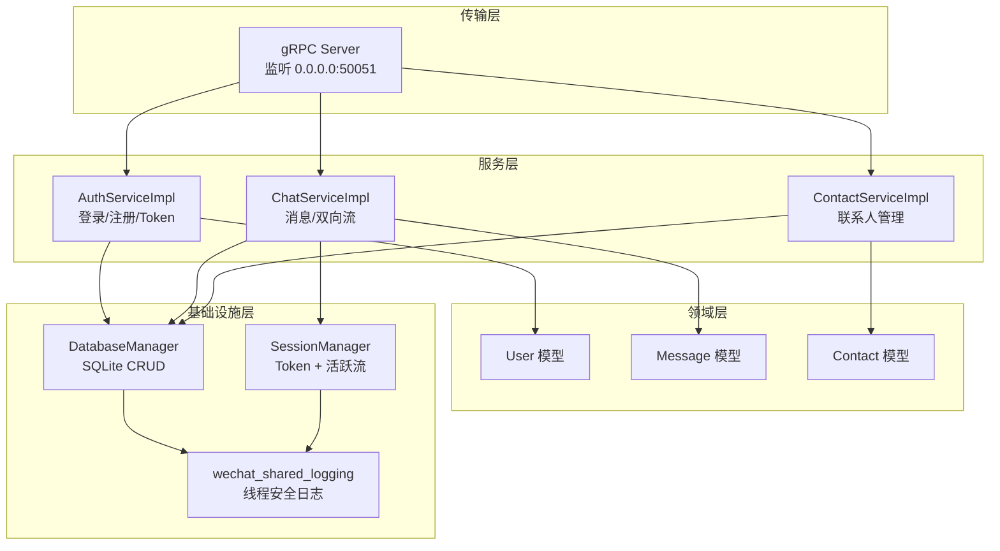
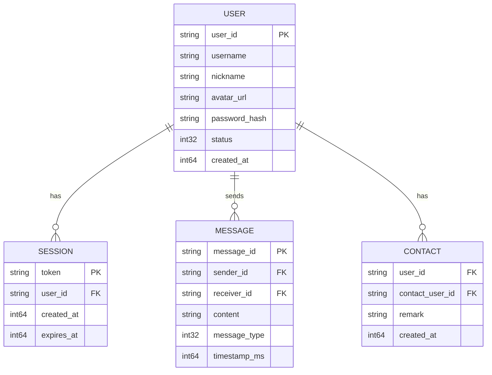
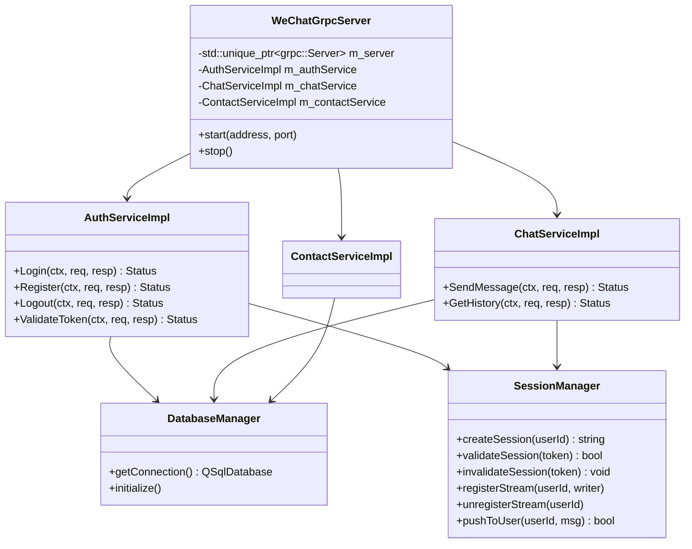
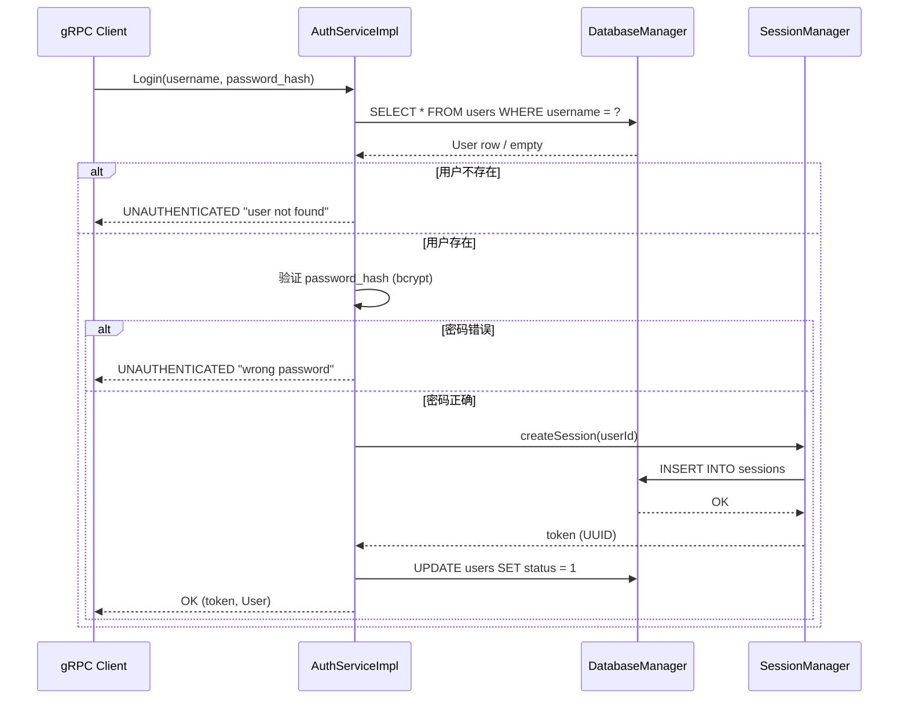
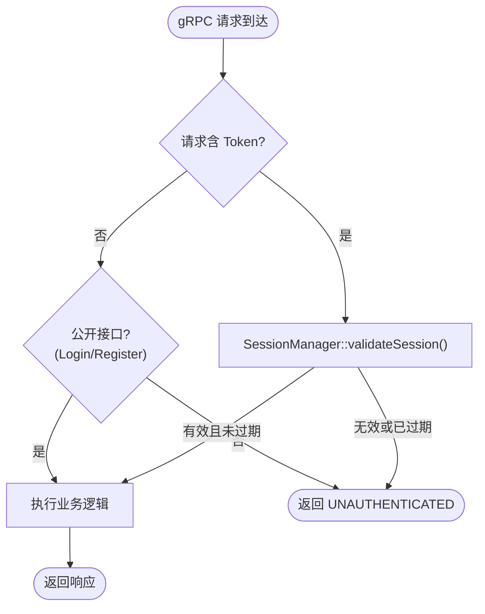

# 后端设计

> 文档版本: v1.1 | 最后更新: 2026-06-21
>
> 相关文档导航:
> - [文档索引](index.md) — 项目概述、文档依赖关系
> - [需求分析](requirements-analysis.md) — 功能需求、用例图
> - [系统架构](system-architecture.md) — 分层设计、线程模型
> - [前端设计](frontend-design.md) — 组件树、MVVM 交互
> - [Proto 服务设计](proto-design.md) — gRPC 服务定义
> - [gRPC 集成方案](grpc-integration.md) — 服务端实现
> - [测试指南](testing-guide.md) — 测试策略、覆盖矩阵
> - [环境配置](environment-setup.md) — IDE、构建命令

---

## 模块导航

本文档是后端设计核心文档。以下功能模块有独立详细设计文档（待 Phase 1 实现时编写）：

| 模块 | 文档 | 说明 |
|------|------|------|
| **用户认证** | [backend/auth.md](backend/auth.md)（待创建） | AuthServiceImpl、SessionManager、Token 管理 |
| **聊天消息** | [backend/chat.md](backend/chat.md)（待创建） | ChatServiceImpl、双向流管理、消息持久化 |
| **联系人** | [backend/contact.md](backend/contact.md)（待创建） | ContactServiceImpl、联系人关系管理 |

---

## 一、技术栈

| 层 | 技术 | 版本 |
|---|------|------|
| 运行时 | Qt QCoreApplication (headless) | 6.10.0 |
| 语言 | C++ | C++17 |
| RPC 框架 | gRPC C++ | 1.78.1 (third_party 预编译) |
| 序列化 | Protocol Buffers | 3.x (gRPC 内置) |
| 数据库 | SQLite (via QSqlDatabase) | Qt6 内置 |
| 并发 | QThreadPool + QMutex | Qt6 内置 |
| 构建 | CMake + MSVC 2022 | 3.21+ / 19.4x |

## 二、整体架构与模块划分

**图1 后端分层包图**：该图展示了后端的四层架构。gRPC Server 接收客户端请求并路由到对应的 Service 实现。Service 层包含 AuthServiceImpl、ChatServiceImpl、ContactServiceImpl 三个核心服务。Domain 层定义纯数据结构。Infrastructure 层提供数据库、Session 管理、日志等基础能力，被所有 Service 共享。

## 三、数据模型

### 3.1 ER 图

**图2 实体关系图（ER 图）**：该图展示了后端的核心数据实体及其关系。`USER` 拥有多个 `SESSION`（支持多设备登录），发送多条 `MESSAGE`，拥有多个 `CONTACT`。`CONTACT` 是 USER 的自引用关系表，记录用户间的联系人关系。

### 3.2 核心表结构

#### User 表

| 字段 | 类型 | 约束 | 说明 |
|------|------|------|------|
| user_id | TEXT | PK | 用户唯一 ID（UUID） |
| username | TEXT | UNIQUE, NOT NULL | 用户名 |
| nickname | TEXT | NOT NULL | 昵称 |
| avatar_url | TEXT | — | 头像 URL |
| password_hash | TEXT | NOT NULL | bcrypt/scrypt 哈希 |
| status | INTEGER | DEFAULT 0 | 0=offline, 1=online, 2=away |
| created_at | INTEGER | NOT NULL | Unix 时间戳（毫秒） |

#### Session 表

| 字段 | 类型 | 约束 | 说明 |
|------|------|------|------|
| token | TEXT | PK | 会话 Token（UUID） |
| user_id | TEXT | FK→User, NOT NULL | 关联用户 |
| created_at | INTEGER | NOT NULL | 创建时间 |
| expires_at | INTEGER | NOT NULL | 过期时间 |

#### Message 表

| 字段 | 类型 | 约束 | 说明 |
|------|------|------|------|
| message_id | TEXT | PK | 消息唯一 ID |
| sender_id | TEXT | FK→User, NOT NULL | 发送者 |
| receiver_id | TEXT | FK→User, NOT NULL | 接收者 |
| content | TEXT | NOT NULL | 消息内容 |
| message_type | INTEGER | DEFAULT 0 | 0=text, 1=image, 2=file |
| timestamp_ms | INTEGER | NOT NULL | 服务端时间戳 |

#### Contact 表

| 字段 | 类型 | 约束 | 说明 |
|------|------|------|------|
| user_id | TEXT | FK→User, NOT NULL | 用户 |
| contact_user_id | TEXT | FK→User, NOT NULL | 联系人 |
| remark | TEXT | — | 备注名 |
| created_at | INTEGER | NOT NULL | 添加时间 |

### 3.3 索引策略

| 表 | 索引 | 用途 |
|----|------|------|
| User | `username` (UNIQUE) | 登录查找 |
| Session | `user_id`, `expires_at` | 查询用户活跃会话、过期清理 |
| Message | `sender_id, timestamp_ms`, `receiver_id, timestamp_ms` | 按用户拉取消息；`(sender_id, receiver_id)` 组合索引用于聊天历史 |
| Contact | `user_id` | 查询用户联系人列表 |

## 四、核心类图

**图3 后端核心类图**：该图展示了后端核心类及其依赖关系。`WeChatGrpcServer` 持有并管理所有 Service 实现。每个 Service 通过构造函数注入共享的 `DatabaseManager` 和 `SessionManager`。`SessionManager` 是实时消息推送的核心，管理活跃双向流注册表。

## 五、核心流程

### 5.1 登录认证流程

**图4 登录认证时序图**：该图展示了用户登录的完整后端流程。AuthServiceImpl 先查询用户是否存在，再验证密码哈希（bcrypt），成功后创建 Session 记录并返回 Token，同时更新用户在线状态。所有数据库操作通过 DatabaseManager 进行。

### 5.2 Token 认证流程图

**图5 Token 认证流程图**：该图展示了 gRPC 请求的认证决策流程。每个请求携带 Token，后端通过 SessionManager 验证有效性（存在且未过期）。Login 和 Register 是公开接口，不需要 Token。其他所有 RPC 都需要有效 Token 才能访问。

## 六、安全与鉴权设计

### 6.1 认证方式

- **Token 认证**：登录成功后服务端生成 UUID Token，客户端保存并在后续请求中携带
- **Token 过期**：默认 24 小时，过期后需重新登录
- **多设备**：每个登录独立生成 Token，支持多设备同时在线

### 6.2 密码安全

| 阶段 | 措施 |
|------|------|
| 传输 | 客户端传输密码哈希值（SHA-256），不传输明文 |
| 存储 | 服务端存储 bcrypt/scrypt 哈希（加盐） |
| 验证 | 服务端使用 bcrypt verify 比对 |

### 6.3 防注入措施

- 所有 SQL 查询使用参数化查询（QSqlQuery::bindValue），防止 SQL 注入
- gRPC 输入使用 protobuf 强类型校验
- 日志输出前对敏感字段（password_hash）脱敏

## 七、服务接口概览

| 服务名称 | RPC 方法 | 对应需求 | 通信模式 | 说明 |
|---------|---------|---------|---------|------|
| AuthService | Login | FR-AUTH-002 | 一元调用 | 用户登录，返回 Token |
| AuthService | Register | FR-AUTH-001 | 一元调用 | 新用户注册 |
| AuthService | Logout | FR-AUTH-003 | 一元调用 | Token 失效 |
| AuthService | ValidateToken | FR-AUTH-004 | 一元调用 | 验证 Token 有效性 |
| ChatService | SendMessage | FR-CHAT-001 | 一元调用 | 发送文字消息 |
| ChatService | StreamMessages | FR-CHAT-002, FR-CHAT-004 | 双向流 | 实时消息推送 + 心跳 |
| ChatService | GetHistory | FR-CHAT-003 | 一元调用 | 获取历史消息（分页） |
| ContactService | GetContacts | FR-CONTACT-001 | 一元调用 | 获取联系人列表 |
| ContactService | AddContact | FR-CONTACT-002 | 一元调用 | 添加联系人 |
| ContactService | DeleteContact | FR-CONTACT-003 | 一元调用 | 删除联系人 |
| ContactService | SearchUsers | FR-CONTACT-004 | 一元调用 | 按关键字搜索用户 |

> 接口详细行为约定（前置条件、后置条件、错误码、幂等性）将在各子模块文档的"API 契约"章节中定义。

## 八、当前实现状态

| 组件 | 状态 | 说明 |
|------|------|------|
| WeChatServer.exe | ✅ 已实现 | QCoreApplication 入口骨架（监听 50051） |
| wechat_services (AuthServiceImpl) | ✅ 已实现 | QObject 骨架，待集成 gRPC Service 基类 |
| wechat_server_domain (User) | ✅ 已实现 | 服务端用户数据结构 |
| wechat_server_infra | ✅ 已实现 | 空壳库（Qt6::Core, Qt6::Sql, wechat_shared_logging） |
| wechat_shared_logging | ✅ 已实现 | 线程安全日志库 |
| wechat_proto | ✅ 已实现 | Proto 消息 + gRPC 服务桩静态库 |
| WeChatGrpcServer | 📋 设计意图 | Phase 1 实现 |
| SessionManager | 📋 设计意图 | Phase 1 实现 |
| DatabaseManager | 📋 设计意图 | Phase 1 实现 |
| ChatServiceImpl | 📋 设计意图 | Phase 1 实现 |
| ContactServiceImpl | 📋 设计意图 | Phase 1 实现 |
