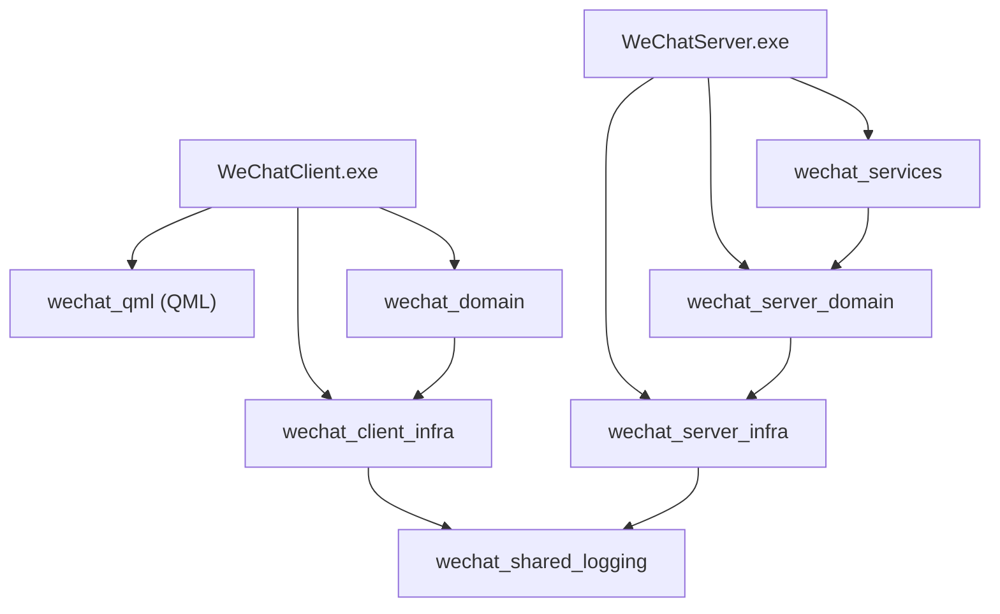

# 构建指南

> 文档版本: v1.0 | 最后更新: 2026-06-20
>
> 相关文档导航:
> - [文档索引](index.md) — 项目概述
> - [环境配置](environment-setup.md) — IDE 与工具链安装
> - [目录结构](directory-structure.md) — CMakeLists.txt 位置

---

## 一、构建环境要求

| 组件 | 版本要求 | 说明 |
|------|---------|------|
| Windows | Windows 10/11 | 开发和运行平台 |
| Visual Studio | 2022 (17.x) | MSVC 编译器 |
| CMake | 3.21+ | 构建系统 |
| Qt | 6.10.0 | 安装路径 `E:/Qt/6.10.0/msvc2022_64` |
| Python | 3.x | CMake 脚本辅助（可选） |

## 二、项目构建结构

```
AutoWeChat/
  CMakeLists.txt              # 根构建文件（CMD 入口）
  CMakePresets.json           # 构建预设
  build/
    windows-msvc2022-debug/   # Debug 构建输出
      frontend/
        src/app/Debug/
          WeChatClient.exe    # 前端可执行文件
      backend/
        src/Debug/
          WeChatServer.exe    # 后端可执行文件
```

## 三、CMake Presets

项目使用 CMakePresets.json 管理构建配置：

```json
{
    "version": 3,
    "configurePresets": [
        {
            "name": "windows-msvc2022-debug",
            "generator": "Visual Studio 17 2022",
            "architecture": { "value": "x64", "strategy": "external" },
            "binaryDir": "${sourceDir}/build/${presetName}",
            "cacheVariables": {
                "CMAKE_BUILD_TYPE": "Debug",
                "CMAKE_PREFIX_PATH": "E:/Qt/6.10.0/msvc2022_64",
                "BUILD_TESTS": "OFF"
            }
        },
        {
            "name": "windows-msvc2022-release",
            "generator": "Visual Studio 17 2022",
            "cacheVariables": {
                "CMAKE_BUILD_TYPE": "Release",
                "CMAKE_PREFIX_PATH": "E:/Qt/6.10.0/msvc2022_64",
                "BUILD_TESTS": "OFF"
            }
        }
    ]
}
```

## 四、编译命令

### 4.1 Debug 构建

```bash
# Step 1: CMake 配置
cmake --preset windows-msvc2022-debug

# Step 2: 构建前端
cmake --build build/windows-msvc2022-debug --config Debug --target WeChatClient --parallel

# Step 3: 构建后端
cmake --build build/windows-msvc2022-debug --config Debug --target WeChatServer --parallel

# Step 4 (可选): 构建全部目标
cmake --build build/windows-msvc2022-debug --config Debug --parallel
```

### 4.2 Release 构建

```bash
cmake --preset windows-msvc2022-release
cmake --build build/windows-msvc2022-release --config Release --parallel
```

### 4.3 开启测试构建

```bash
cmake --preset windows-msvc2022-debug -DBUILD_TESTS=ON
cmake --build build/windows-msvc2022-debug --config Debug --parallel
ctest --test-dir build/windows-msvc2022-debug -C Debug --output-on-failure
```

### 4.4 安装

```bash
cmake --install build/windows-msvc2022-debug --config Debug --prefix install/debug
```

安装时 wedeployqt 会自动将 Qt DLL 复制到安装目录。

## 五、CMake 构建目标

| 目标 | 类型 | 说明 |
|------|------|------|
| `WeChatClient` | EXE | 前端 Qt QML 桌面客户端 |
| `WeChatServer` | EXE | 后端 headless 服务端 |
| `wechat_shared_logging` | STATIC LIB | 共享日志库 |
| `wechat_qml` | STATIC LIB (QML Module) | 前端 QML 模块 |
| `wechat_domain` | STATIC LIB | 前端数据模型 |
| `wechat_client_infra` | STATIC LIB | 前端基础设施 |
| `wechat_services` | STATIC LIB | 后端业务服务 |
| `wechat_server_domain` | STATIC LIB | 后端数据模型 |
| `wechat_server_infra` | STATIC LIB | 后端基础设施 |

## 六、目标依赖关系



**图1 构建目标依赖图**：该图展示了所有 CMake 目标的依赖关系。`wechat_shared_logging` 是唯一被两端链接的共享目标。Proto 库（`wechat_proto`）将在 gRPC 集成后同时被前端和后端链接。

## 七、常见问题

### windeployqt 找不到

```
WARNING: windeployqt6 not found in standard locations.
```

**解决**：确认 Qt 安装路径与 CMakePresets.json 中的 `CMAKE_PREFIX_PATH` 一致（默认 `E:/Qt/6.10.0/msvc2022_64`）。

### 修改 Qt 安装路径

如果你的 Qt 安装在其他位置，修改根目录 `CMakePresets.json` 中的 `CMAKE_PREFIX_PATH` 和 `environment.QT_DIR`。

### QML 模块导入失败

```
Failed to import WeChatClient.
```

**解决**：先完成 CMake 构建，QML 模块由构建系统生成。构建前 IDE 的 linter 可能会报此警告，属于正常现象。

### 仅构建特定目标

```bash
# 仅构建前端
cmake --build build/windows-msvc2022-debug --config Debug --target WeChatClient

# 仅构建后端
cmake --build build/windows-msvc2022-debug --config Debug --target WeChatServer
```
