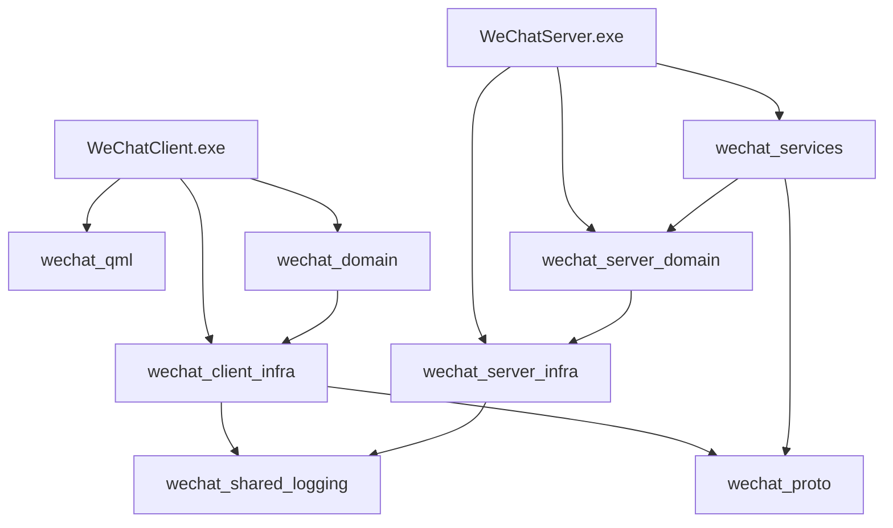

# 环境配置

> 文档版本: v1.1 | 最后更新: 2026-06-21
>
> 相关文档导航:
> - [文档索引](index.md) — 项目概述、快速开始
> - [需求分析](requirements-analysis.md) — 功能需求、用例图
> - [系统架构](system-architecture.md) — 分层设计、线程模型
> - [前端设计](frontend-design.md) — 组件树、MVVM 交互
> - [后端设计](backend-design.md) — ER图、Service接口
> - [gRPC 集成方案](grpc-integration.md) — 依赖集成
> - [测试指南](testing-guide.md) — 测试运行命令

---

## 一、开发环境要求

| 组件 | 版本 | 下载地址 | 说明 |
|------|------|---------|------|
| Windows | 10 / 11 | — | 开发与运行操作系统 |
| Visual Studio 2022 | 17.x Community | https://visualstudio.microsoft.com/ | 选择"使用 C++ 的桌面开发"工作负载 |
| CMake | 3.21+ | https://cmake.org/download/ | 勾选"Add CMake to system PATH" |
| Qt 6 | 6.10.0 | https://www.qt.io/download | 安装 MSVC 2022 64-bit 组件 |
| Git | 2.x | https://git-scm.com/ | 版本控制 |
| VS Code (可选) | latest | https://code.visualstudio.com/ | 推荐安装 CMake Tools 和 Qt 插件 |

## 二、Qt 安装

1. 下载 Qt Online Installer 或使用 Qt Maintenance Tool
2. 选择 Qt 6.10.0 → MSVC 2022 64-bit
3. 安装路径建议：`E:/Qt/6.10.0/msvc2022_64`
4. 将 `E:/Qt/6.10.0/msvc2022_64/bin` 添加到系统 PATH（可选）

验证安装：

```bash
E:/Qt/6.10.0/msvc2022_64/bin/qmake --version
E:/Qt/6.10.0/msvc2022_64/bin/windeployqt6 --help
```

## 三、第三方依赖

### 3.1 gRPC 1.78.1 预编译包

项目使用 gRPC 1.78.1 预编译静态库，包含 Debug + Release 双版本，位于 `third_party/grpc1.78.1/`。

该目录由 `.gitignore` 忽略，不纳入版本控制，需单独获取：

> 从 [内部共享位置] 下载 `grpc1.78.1-win-msvc2022-x64.zip`，解压到 `third_party/grpc1.78.1/`

**解压后验证**：

```bash
# 检查头文件
ls third_party/grpc1.78.1/include/grpcpp/grpcpp.h

# 检查 cmake 包配置
ls third_party/grpc1.78.1/lib/cmake/grpc/gRPCConfig.cmake
ls third_party/grpc1.78.1/lib/cmake/protobuf/protobuf-config.cmake

# 检查 protoc 工具
ls third_party/grpc1.78.1/bin/protoc.exe
ls third_party/grpc1.78.1/bin/grpc_cpp_plugin.exe
```

### 3.2 目录结构

```
third_party/grpc1.78.1/
  include/        # gRPC / Protobuf / Abseil / OpenSSL 头文件
  lib/            # .lib 静态库 + cmake/ 包配置
    cmake/
      grpc/       # gRPC CMake 配置 (gRPCTargets-{debug,release}.cmake)
      protobuf/   # Protobuf CMake 配置 (protobuf-targets-{debug,release}.cmake)
      absl/       # Abseil CMake 配置
      c-ares/
      re2/
      utf8_range/
  bin/            # protoc.exe, grpc_cpp_plugin.exe 等工具
  share/          # roots.pem (TLS 证书)
```

### 3.3 CMake 自动发现

根 `CMakeLists.txt` 已配置自动发现路径：

```cmake
list(APPEND CMAKE_PREFIX_PATH "${CMAKE_SOURCE_DIR}/third_party/grpc1.78.1")
```

无需手动设置环境变量或修改 `CMakePresets.json`。

## 四、Visual Studio 2022 配置

1. 安装时选择 **"使用 C++ 的桌面开发"** 工作负载
2. 确保包含以下组件：
   - MSVC v143 - VS 2022 C++ x64/x86 生成工具
   - Windows 11 SDK (10.0.22621.0+)
   - 适用于 Windows 的 CMake 工具（或单独安装 CMake）
3. 验证：

```bash
cl --version   # Microsoft (R) C/C++ Optimizing Compiler Version 19.4x
```

## 五、VS Code 配置（可选）

项目已配置 `.vscode/settings.json`：

```json
{
    "cmake.sourceDirectory": "D:/git/work/AutoWeChat"
}
```

推荐扩展：
- **CMake Tools** (ms-vscode.cmake-tools) — CMake 集成、预设选择、一键构建
- **Qt for Python / Qt Tools** — QML 语法高亮
- **clangd** — C++ 智能提示

使用 CMake Tools 构建：
1. `Ctrl+Shift+P` → "CMake: Select Configure Preset" → "windows-msvc2022-debug"
2. `Ctrl+Shift+P` → "CMake: Build"

## 六、CMake Presets

项目使用 CMakePresets.json 管理构建配置：

```json
{
    "version": 3,
    "configurePresets": [
        {
            "name": "windows-msvc2022-debug",
            "generator": "Visual Studio 17 2022",
            "architecture": { "value": "x64", "strategy": "external" },
            "binaryDir": "${sourceDir}/build/${presetName}",
            "cacheVariables": {
                "CMAKE_BUILD_TYPE": "Debug",
                "CMAKE_PREFIX_PATH": "E:/Qt/6.10.0/msvc2022_64",
                "BUILD_TESTS": "OFF"
            },
            "environment": {
                "QT_DIR": "E:/Qt/6.10.0/msvc2022_64"
            }
        },
        {
            "name": "windows-msvc2022-release",
            "generator": "Visual Studio 17 2022",
            "cacheVariables": {
                "CMAKE_BUILD_TYPE": "Release",
                "CMAKE_PREFIX_PATH": "E:/Qt/6.10.0/msvc2022_64",
                "BUILD_TESTS": "OFF"
            }
        }
    ],
    "buildPresets": [
        { "name": "debug", "configurePreset": "windows-msvc2022-debug" },
        { "name": "release", "configurePreset": "windows-msvc2022-release" }
    ]
}
```

> `CMAKE_PREFIX_PATH` 只包含 Qt 路径。gRPC 路径由根 `CMakeLists.txt` 中的 `list(APPEND CMAKE_PREFIX_PATH ...)` 添加。

## 七、编译命令

### 7.1 Debug 构建

```bash
# Step 1: CMake 配置
cmake --preset windows-msvc2022-debug

# Step 2: 构建 proto 库（验证 gRPC 集成）
cmake --build build/windows-msvc2022-debug --config Debug --target wechat_proto --parallel

# Step 3: 构建前端
cmake --build build/windows-msvc2022-debug --config Debug --target WeChatClient --parallel

# Step 4: 构建后端
cmake --build build/windows-msvc2022-debug --config Debug --target WeChatServer --parallel

# Step 5 (可选): 构建全部
cmake --build build/windows-msvc2022-debug --config Debug --parallel
```

### 7.2 Release 构建

```bash
cmake --preset windows-msvc2022-release
cmake --build build/windows-msvc2022-release --config Release --parallel
```

### 7.3 测试构建

```bash
cmake --preset windows-msvc2022-debug -DBUILD_TESTS=ON
cmake --build build/windows-msvc2022-debug --config Debug --parallel
ctest --test-dir build/windows-msvc2022-debug -C Debug --output-on-failure
```

### 7.4 安装

```bash
cmake --install build/windows-msvc2022-debug --config Debug --prefix install/debug
```

安装时 windeployqt 会自动将 Qt DLL 复制到安装目录。

## 八、CMake 构建目标

| 目标 | 类型 | 说明 |
|------|------|------|
| `WeChatClient` | EXE | 前端 Qt QML 桌面客户端 |
| `WeChatServer` | EXE | 后端 headless 服务端 |
| `wechat_proto` | STATIC LIB | Proto 消息 + gRPC 服务桩代码 |
| `wechat_shared_logging` | STATIC LIB | 共享日志库（线程安全） |
| `wechat_qml` | STATIC LIB (QML Module) | 前端 QML 模块 |
| `wechat_domain` | STATIC LIB | 前端数据模型 |
| `wechat_client_infra` | STATIC LIB | 前端基础设施 |
| `wechat_services` | STATIC LIB | 后端业务服务 |
| `wechat_server_domain` | STATIC LIB | 后端数据模型 |
| `wechat_server_infra` | STATIC LIB | 后端基础设施 |

### 8.1 目标依赖关系



**图1 CMake 目标依赖图**：该图展示了所有 CMake 目标的依赖关系。`wechat_shared_logging` 是唯一被两端链接的共享目标。`wechat_proto` 同时被前端 `wechat_client_infra` 和后端 `wechat_services` 链接，提供 gRPC 消息类型和服务桩代码。

## 九、常见问题

### windeployqt 找不到

```
WARNING: windeployqt6 not found in standard locations.
```

**解决**：确认 Qt 安装路径与 CMakePresets.json 中的 `CMAKE_PREFIX_PATH` 一致（默认 `E:/Qt/6.10.0/msvc2022_64`）。

### 修改 Qt 安装路径

修改 `CMakePresets.json` 中的 `CMAKE_PREFIX_PATH` 和 `environment.QT_DIR`。

### QML 模块导入失败

```
Failed to import WeChatClient.
```

**解决**：先完成 CMake 构建，QML 模块由构建系统生成。构建前 IDE linter 的警告属正常现象。

### gRPC 找不到

```
CMake Error: find_package(protobuf CONFIG) failed.
```

**解决**：确认 `third_party/grpc1.78.1/` 目录存在且结构完整（参见 §三 验证步骤）。根 `CMakeLists.txt` 已配置自动发现，无需手动设置环境变量。

### 仅构建特定目标

```bash
cmake --build build/windows-msvc2022-debug --config Debug --target WeChatClient
cmake --build build/windows-msvc2022-debug --config Debug --target WeChatServer
cmake --build build/windows-msvc2022-debug --config Debug --target wechat_proto
```

## 十、验证环境

```bash
# 1. 检查 third_party 存在
ls third_party/grpc1.78.1/bin/protoc.exe
ls third_party/grpc1.78.1/lib/cmake/grpc/gRPCConfig.cmake

# 2. CMake 配置
cmake --preset windows-msvc2022-debug

# 3. 构建 proto 库（验证 gRPC 集成）
cmake --build build/windows-msvc2022-debug --config Debug --target wechat_proto --parallel

# 4. 构建前端
cmake --build build/windows-msvc2022-debug --config Debug --target WeChatClient --parallel

# 5. 构建后端
cmake --build build/windows-msvc2022-debug --config Debug --target WeChatServer --parallel

# 6. 运行前端
./build/windows-msvc2022-debug/frontend/src/app/Debug/WeChatClient.exe

# 7. 运行后端
./build/windows-msvc2022-debug/backend/src/Debug/WeChatServer.exe
```

如果前端窗口正常显示（960x540，标题 "AutoWeChat"），后端控制台输出 "WeChat Server starting on port 50051..."，则环境配置正确。
