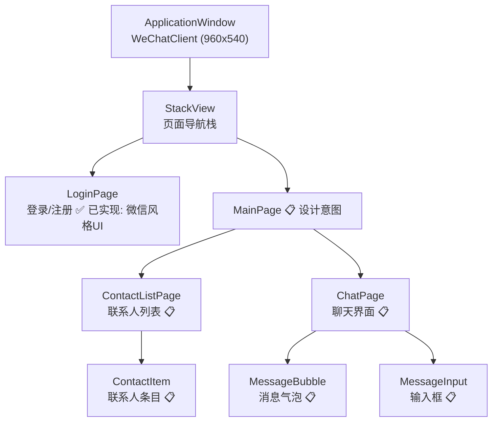
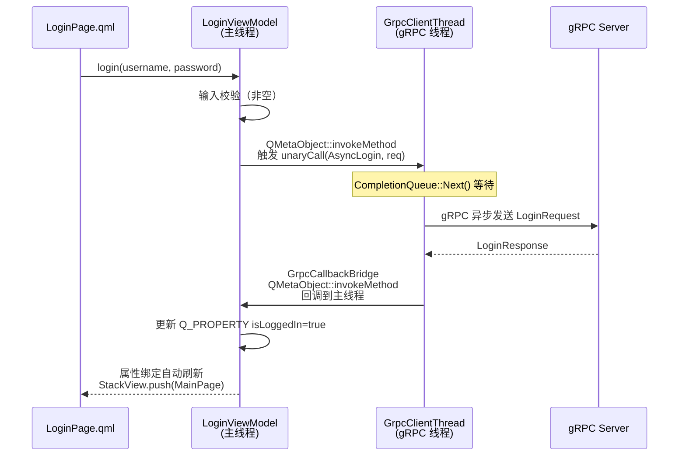
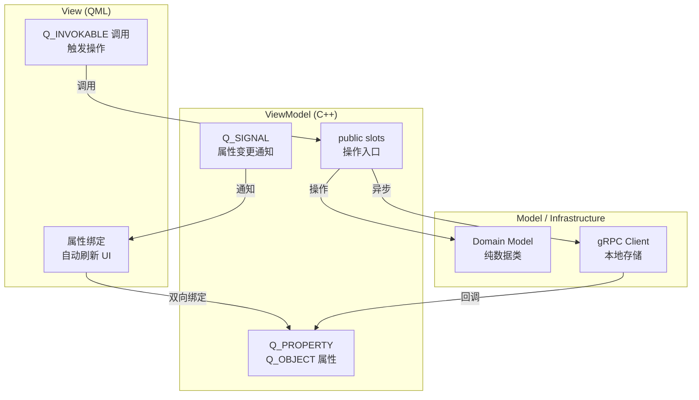

# 前端设计

> 文档版本: v1.1 | 最后更新: 2026-06-21
>
> 相关文档导航:
> - [文档索引](index.md) — 项目概述、文档依赖关系
> - [需求分析](requirements-analysis.md) — 功能需求、用例图
> - [系统架构](system-architecture.md) — 分层设计、线程模型
> - [后端设计](backend-design.md) — ER图、Service接口
> - [Proto 服务设计](proto-design.md) — gRPC 服务定义
> - [gRPC 集成方案](grpc-integration.md) — 客户端实现
> - [测试指南](testing-guide.md) — 测试策略、覆盖矩阵
> - [环境配置](environment-setup.md) — IDE、构建命令

---

## 模块导航

本文档是前端设计核心文档。以下功能模块有独立详细设计文档（待 Phase 1 实现时编写）：

| 模块 | 文档 | 说明 |
|------|------|------|
| **用户认证** | [frontend/auth.md](frontend/auth.md)（待创建） | LoginPage、RegisterPage、LoginViewModel |
| **聊天消息** | [frontend/chat.md](frontend/chat.md)（待创建） | ChatPage、MessageBubble、ChatListViewModel |
| **联系人** | [frontend/contact.md](frontend/contact.md)（待创建） | ContactListPage、AddContactPage、ContactViewModel |

---

## 一、技术栈

| 层 | 技术 | 版本 |
|---|------|------|
| UI 框架 | Qt QML (Quick Controls) | 6.10.0 |
| 脚本语言 | QML / JavaScript | ES5 子集 |
| 逻辑层 | C++ ViewModel (MVVM) | C++17 |
| 通信 | gRPC C++ | 1.78.1 (third_party 预编译) |
| 本地存储 | SQLite (via QSqlDatabase) | Qt6 内置 |
| 构建 | CMake + MSVC 2022 | 3.21+ / 19.4x |

## 二、UI 组件树



**图1 前端 UI 组件树**：该图展示了 QML 应用的整体组件层次。`ApplicationWindow` 为根节点，`StackView` 管理页面导航。当前 Phase 0 已实现 Main.qml 主窗口和 LoginPage 微信风格 UI。MainPage、ChatPage 等页面待 Phase 1 实现。

## 三、路由设计

前端使用 `StackView` 实现页面导航，不使用 URL 路由（桌面应用特性）。

| 路由标识 | 页面组件 | 进入条件 | 参数 |
|---------|---------|---------|------|
| `login` | LoginPage | 未登录 / Token 过期 | — |
| `main` | MainPage | 登录成功 | User |
| `chat` | ChatPage | 选择联系人 | peerUserId, peerUsername |
| `addContact` | AddContactPage | 点击添加联系人 | — |
| `searchUser` | SearchUserPage | 搜索用户 | keyword |

### 页面状态覆盖

| 页面 | Loading | Empty | Error | Normal |
|------|---------|-------|-------|--------|
| LoginPage | 登录按钮 loading 动画 | — | 错误提示（用户名/密码错误） | 登录表单 |
| ContactListPage | 列表加载中 | "暂无联系人" 提示 | 网络错误 + 重试按钮 | 联系人列表 |
| ChatPage | 历史消息加载中 | "暂无消息，发送第一条吧" | 发送失败气泡（红色+重试） | 消息列表 + 输入框 |

## 四、交互时序图（以登录为例）



**图2 登录交互时序图**：该图展示了用户登录操作的完整前后端交互流程。QML 触发 login 操作 → ViewModel 输入校验 → gRPC 线程异步发送请求 → 响应通过 GrpcCallbackBridge 安全回调主线程 → ViewModel 更新 Q_PROPERTY → QML 自动刷新 UI 并导航到主页。全程 Qt 主线程不被阻塞。

> **标注说明**：虚线箭头表示异步跨线程操作。ViewModel 不直接调用 gRPC API，而是通过 QMetaObject::invokeMethod 将任务派发到专用 gRPC 线程。

## 五、状态管理方案

### 5.1 架构总览

前端状态管理基于 **Q_PROPERTY + Q_INVOKABLE** 的 MVVM 模式，不使用第三方状态管理库。



**图3 MVVM 状态管理架构**：该图展示了 Qt/QML 原生 MVVM 的数据流。QML 通过属性绑定自动响应 ViewModel 属性变化，通过 Q_INVOKABLE 触发操作。ViewModel 通过 Q_SIGNAL 通知 UI 刷新。基础设施层（gRPC 客户端）通过回调更新 ViewModel 属性。

### 5.2 ViewModel 清单

| ViewModel | 状态 | 核心属性 | 说明 |
|-----------|------|---------|------|
| `ApplicationControllerViewModel` | ✅ 已实现 | `LogViewModel* logViewModel` | 根 ViewModel，持有其他 ViewModel |
| `LogViewModel` | ✅ 已实现 | `QString allLogs` | 日志展示 ViewModel |
| `LoginViewModel` | 📋 设计意图 | `bool isLoggedIn`, `QString errorMsg` | 登录/注册逻辑 |
| `ContactListViewModel` | 📋 设计意图 | `QList<Contact> contacts` | 联系人列表管理 |
| `ChatListViewModel` | 📋 设计意图 | `QList<Message> messages` | 聊天消息管理 |

## 六、核心组件设计要点

### 6.1 ApplicationControllerViewModel（根 ViewModel）

**文件**：[frontend/src/app/viewModel/ApplicationControllorViewModel.h](frontend/src/app/viewModel/ApplicationControllorViewModel.h)

职责：作为 QML 入口点，持有并暴露所有子 ViewModel。后续 Phase 将在此注册 LoginViewModel、ChatListViewModel 等。

当前实现：
- Q_PROPERTY(LogViewModel* logViewModel READ logViewModel CONSTANT)
- init() 方法初始化日志系统
- 通过 `qmlRegisterSingletonInstance` 暴露给 QML

### 6.2 LogViewModel

**文件**：[frontend/src/app/viewModel/LogViewModel.h](frontend/src/app/viewModel/LogViewModel.h)

职责：聚合全局日志，通过 Q_PROPERTY 绑定到 QML 视图展示。

关键设计：
- `appendLog(QString msg)` — 日志追加入口（Q_INVOKABLE）
- `clearLogs()` — 清空日志（Q_INVOKABLE）
- Q_PROPERTY allLogs — 绑定到 QML TextArea

## 七、构建与 windeployqt 部署方案

### 7.1 构建命令

```bash
cmake --preset windows-msvc2022-debug
cmake --build build/windows-msvc2022-debug --config Debug --target WeChatClient --parallel
```

### 7.2 windeployqt 自动部署

`frontend/CMakeLists.txt` 在构建后自动运行 windeployqt6，将 Qt DLL、QML 模块、插件等复制到可执行文件所在目录。无需手动操作。

```cmake
add_custom_command(TARGET WeChatClient POST_BUILD
    COMMAND ${WINDEPLOYQT} "$<TARGET_FILE:WeChatClient>" --qmldir "${CMAKE_SOURCE_DIR}"
    COMMENT "Running windeployqt to copy Qt6 DLLs to build directory"
)
```

## 八、当前实现状态

| 组件 | 状态 | 说明 |
|------|------|------|
| Main.qml (ApplicationWindow) | ✅ 已实现 | 960x540 主窗口骨架 |
| ApplicationControllerViewModel | ✅ 已实现 | 根 ViewModel，暴露 LogViewModel |
| LogViewModel | ✅ 已实现 | Q_PROPERTY allLogs，Q_INVOKABLE clearLogs |
| wechat_qml (QML Module) | ✅ 已实现 | URI "WeChatClient"，STATIC LIB |
| LoginPage (UI) | ✅ 已实现 | 微信风格登录界面，头像+输入框+密码切换+登录按钮 |
| LoginViewModel | 📋 设计意图 | Phase 1 实现（gRPC 登录逻辑） |
| ChatPage / ChatListViewModel | 📋 设计意图 | Phase 1 实现 |
| ContactListPage / ContactViewModel | 📋 设计意图 | Phase 1 实现 |
| GrpcClientThread | 📋 设计意图 | Phase 1 实现，详见 [gRPC 集成方案](grpc-integration.md) |
| GrpcCallbackBridge | 📋 设计意图 | Phase 1 实现 |
| GrpcMessageStream | 📋 设计意图 | Phase 1 实现 |
