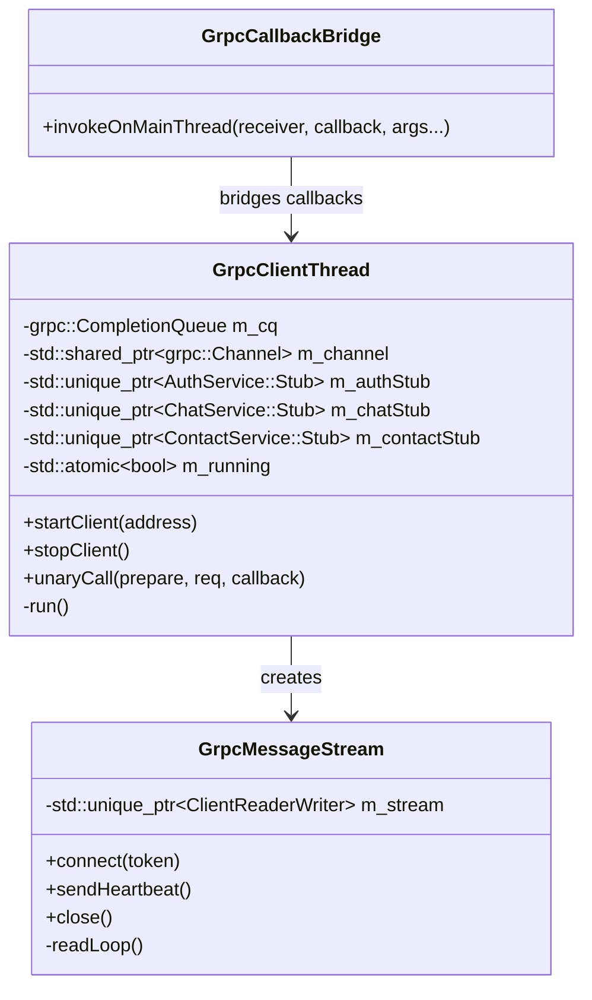
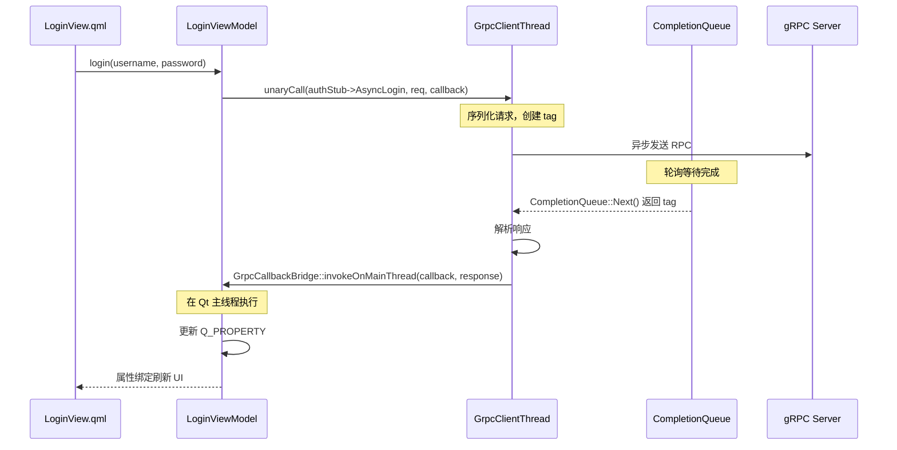
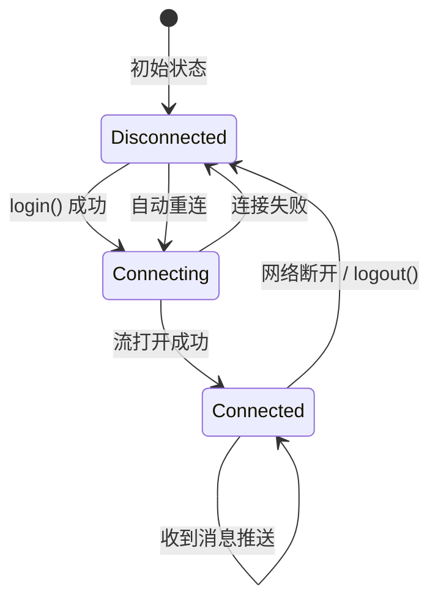

# gRPC 集成方案

> 文档版本: v1.1 | 最后更新: 2026-06-21
>
> 相关文档导航:
> - [文档索引](index.md) — 项目概述、文档依赖关系
> - [系统架构](system-architecture.md) — 线程模型、数据流
> - [前端设计](frontend-design.md) — 组件树、MVVM 交互
> - [后端设计](backend-design.md) — ER图、Service接口
> - [Proto 服务设计](proto-design.md) — 服务定义
> - [环境配置](environment-setup.md) — IDE、构建命令

---

## 一、集成概述

AutoWeChat 使用 gRPC C++ 作为唯一的网络通信框架。核心设计原则：

1. **前端非阻塞**：所有 gRPC 调用在专用线程上执行，永不阻塞 Qt 主线程
2. **异步回调桥接**：gRPC 完成回调安全地调度回 Qt 主线程
3. **双向流**：用 gRPC 双向流替代 WebSocket 实现实时消息推送

## 二、依赖集成

### 2.1 预编译包说明

gRPC 及其所有依赖已编译为 **静态库双版本**（Debug + Release），放置于 `third_party/grpc1.78.1/`。

| 目录 | 内容 |
|------|------|
| `include/` | gRPC / Protobuf / Abseil / OpenSSL / c-ares / re2 / zlib 头文件 |
| `lib/` | 所有 `.lib` 静态库（Debug + Release 双版本，含 cmake 包配置） |
| `lib/cmake/` | gRPC / Protobuf / Abseil / c-ares / re2 / utf8_range 的 CMake 包配置 |
| `bin/` | `protoc.exe`、`grpc_cpp_plugin.exe` 等工具 |

根 `CMakeLists.txt` 在 `add_subdirectory(proto)` 之前已添加路径：

```cmake
list(APPEND CMAKE_PREFIX_PATH "${CMAKE_SOURCE_DIR}/third_party/grpc1.78.1")
```

`proto/CMakeLists.txt` 中 `find_package(protobuf CONFIG)` 和 `find_package(gRPC CONFIG)` 自动在 `<prefix>/lib/cmake/protobuf/` 和 `<prefix>/lib/cmake/grpc/` 下找到包配置。

### 2.2 实际 proto/CMakeLists.txt 配置

```cmake
find_package(protobuf CONFIG REQUIRED)
find_package(gRPC CONFIG REQUIRED)

# 生成 .pb.h/.pb.cc
protobuf_generate(LANGUAGE cpp PROTOS ${PROTO_FILES} OUT_VAR PROTO_GENERATED)

# 生成 .grpc.pb.h/.grpc.pb.cc（protoc + grpc_cpp_plugin）
set(GRPC_GENERATED)
foreach(PROTO_FILE ${PROTO_FILES})
    get_filename_component(_basename ${PROTO_FILE} NAME_WE)
    set(_grpc_h "${CMAKE_CURRENT_BINARY_DIR}/${_basename}.grpc.pb.h")
    set(_grpc_cc "${CMAKE_CURRENT_BINARY_DIR}/${_basename}.grpc.pb.cc")
    list(APPEND GRPC_GENERATED ${_grpc_h} ${_grpc_cc})
    add_custom_command(
        OUTPUT ${_grpc_h} ${_grpc_cc}
        COMMAND protobuf::protoc
        ARGS --grpc_out=${CMAKE_CURRENT_BINARY_DIR}
             --plugin=protoc-gen-grpc=$<TARGET_FILE:gRPC::grpc_cpp_plugin>
             -I${CMAKE_CURRENT_SOURCE_DIR}
             ${CMAKE_CURRENT_SOURCE_DIR}/${PROTO_FILE}
        DEPENDS ${PROTO_ABS_FILES} protobuf::protoc gRPC::grpc_cpp_plugin
        VERBATIM
    )
endforeach()

add_library(wechat_proto STATIC ${PROTO_GENERATED} ${GRPC_GENERATED})
target_link_libraries(wechat_proto PUBLIC protobuf::libprotobuf gRPC::grpc++)
```

**关键点**：
- `$<TARGET_FILE:gRPC::grpc_cpp_plugin>` 在构建时自动选择 Debug/Release 版插件
- `protobuf::protoc` 作为 COMMAND 自动解析为可执行文件路径
- `DEPENDS` 包含所有 proto 文件，解决 import 增量编译

### 2.3 前后端链接

```cmake
# frontend/src/infrastructure/CMakeLists.txt
target_link_libraries(wechat_client_infra PUBLIC ... wechat_proto)

# backend/src/service/CMakeLists.txt
target_link_libraries(wechat_services PUBLIC ... wechat_proto)
```

> `wechat_proto` 使用 PUBLIC 链接，依赖目标也可访问 proto 生成的头文件。

## 三、前端 gRPC 客户端架构（📋 设计意图，待 Phase 1 实现）

### 3.1 核心类设计



**图1 前端 gRPC 核心类图**：该图展示了前端 gRPC 客户端的三个核心类。`GrpcClientThread` 是专用 QThread，运行 CompletionQueue 循环并持有所有 Service Stub。`GrpcCallbackBridge` 是模板工具类，将 gRPC 完成回调安全调度回 Qt 主线程。`GrpcMessageStream` 管理双向流生命周期。

### 3.2 GrpcClientThread 设计

```cpp
// GrpcClientThread  —— 专用 QThread，运行 gRPC CompletionQueue 循环
// 此类存放于 frontend/src/infrastructure/grpc/GrpcClientThread.h

class GrpcClientThread : public QThread {
    Q_OBJECT
public:
    void startClient(const QString &serverAddress);  // 连接服务器
    void stopClient();                                // 断开连接

    // 通用一元 RPC 调用模板
    template <typename Request, typename Response,
              typename Stub, typename PrepareFunc, typename Callback>
    void unaryCall(PrepareFunc prepare,
                   const Request &req,
                   QObject *receiver,
                   Callback callback);

signals:
    void connected();
    void disconnected(const QString &reason);

protected:
    void run() override;  // CompletionQueue::Next() 循环

private:
    grpc::CompletionQueue m_cq;
    std::shared_ptr<grpc::Channel> m_channel;
    std::unique_ptr<wechat::AuthService::Stub> m_authStub;
    std::unique_ptr<wechat::ChatService::Stub> m_chatStub;
    std::unique_ptr<wechat::ContactService::Stub> m_contactStub;
    std::atomic<bool> m_running{false};
};
```

### 3.3 GrpcCallbackBridge 设计

```cpp
// GrpcCallbackBridge  —— 安全地将 gRPC 完成回调调度到 Qt 主线程
// 存放于 frontend/src/infrastructure/grpc/GrpcCallbackBridge.h

template <typename Callback>
class GrpcCallbackBridge {
public:
    // 在线程安全的前提下调用回调
    static void invokeOnMainThread(QObject *receiver,
                                   Callback &&cb,
                                   auto &&...args) {
        QMetaObject::invokeMethod(
            receiver,
            [cb = std::forward<Callback>(cb),
             ... args = std::forward<decltype(args)>(args)]() mutable {
                cb(std::forward<decltype(args)>(args)...);
            },
            Qt::QueuedConnection);
    }
};
```

### 3.4 gRPC 调用完整链路（以 Login 为例）



**图2 Login gRPC 调用时序图**：该图展示了一次完整的一元 RPC 调用的生命周期。QML 触发操作 → ViewModel 派发到 gRPC 线程 → gRPC 异步发送网络请求 → CompletionQueue 收到完成事件 → 通过 GrpcCallbackBridge 安全回调主线程 → ViewModel 更新属性 → UI 自动刷新。

## 四、双向流实现（📋 设计意图，待 Phase 1 实现）

### 4.1 类设计

```cpp
// GrpcMessageStream  —— 管理 ChatService::StreamMessages 双向流
// 存放于 frontend/src/infrastructure/grpc/GrpcMessageStream.h

class GrpcMessageStream : public QObject {
    Q_OBJECT
public:
    explicit GrpcMessageStream(QObject *parent = nullptr);

    void connect(const QString &token);   // 打开双向流
    void sendHeartbeat();                  // 发送心跳
    void close();                          // 关闭流

signals:
    void messageReceived(const wechat::TextMessage &msg);
    void userStatusChanged(const QString &userId, int status);
    void streamDisconnected();

private:
    void readLoop();  // 在 gRPC 线程上运行，循环读取服务端推送
    void writeLoop(); // 在 gRPC 线程上运行，循环发送心跳

    std::unique_ptr<grpc::ClientReaderWriter<
        wechat::StreamMessageRequest,
        wechat::StreamMessageResponse>> m_stream;
    grpc::ClientContext m_context;
    std::atomic<bool> m_connected{false};
};
```

### 4.2 双向流生命周期



**图3 双向流状态图**：该图展示了 StreamMessages 双向流的状态流转。登录成功后打开流进入 Connected 状态，通过心跳保活。当收到服务端推送时触发 messageReceived 信号。连接断开后支持自动重连。

### 4.3 心跳机制

客户端每隔 30 秒发送一个空的 `StreamMessageRequest`（仅携带 token）。服务端回复 `heartbeat_ack`。如果连续 3 次（90 秒）未收到回复，客户端主动断开并重连。

## 五、后端 gRPC Server 架构（📋 设计意图，待 Phase 1 实现）

### 5.1 WeChatGrpcServer

```cpp
// WeChatGrpcServer  —— 管理 gRPC 服务端生命周期
// 存放于 backend/src/server/WeChatGrpcServer.h

class WeChatGrpcServer : public QObject {
    Q_OBJECT
public:
    WeChatGrpcServer(const QString &address, int port);
    void start();  // 启动 gRPC Server
    void stop();   // 优雅关闭

private:
    std::unique_ptr<grpc::Server> m_server;
    AuthServiceImpl m_authService;
    ChatServiceImpl m_chatService;
    ContactServiceImpl m_contactService;
    // 共享依赖：DatabaseManager, SessionManager
};
```

### 5.2 Service 实现模式

```cpp
// AuthServiceImpl  —— 继承 gRPC 生成的 Service 基类
class AuthServiceImpl final : public wechat::AuthService::Service {
public:
    AuthServiceImpl(std::shared_ptr<DatabaseManager> db,
                    std::shared_ptr<SessionManager> sessions);

    grpc::Status Login(grpc::ServerContext *ctx,
                       const wechat::LoginRequest *req,
                       wechat::LoginResponse *resp) override;
    // ...
};
```

每个 Service 实现通过构造函数注入共享依赖（DatabaseManager、SessionManager）。

### 5.3 SessionManager（实时消息推送核心）

```cpp
class SessionManager {
public:
    // 管理活跃的 StreamMessages 流
    void registerStream(const QString &userId,
                        grpc::ServerWriter<StreamMessageResponse> *writer);
    void unregisterStream(const QString &userId);

    // 向指定用户推送消息
    bool pushToUser(const QString &userId,
                    const StreamMessageResponse &msg);

private:
    QMutex m_mutex;
    QHash<QString, QVector<grpc::ServerWriter<StreamMessageResponse>*>>
        m_userStreams;  // userId -> 活跃流列表
};
```

当一个用户向另一个用户发送消息时，`ChatServiceImpl` 调用 `SessionManager::pushToUser(receiverId, msg)`，SessionManager 查找接收者的活跃流并写入响应。

## 六、线程安全总结

| 组件 | 所在线程 | 线程安全机制 |
|------|---------|-------------|
| ViewModel | Qt 主线程 | 仅主线程操作 |
| GrpcClientThread | 专用 QThread | CompletionQueue 单线程轮询 |
| GrpcMessageStream | gRPC 线程（读/写） | atomic flag |
| GrpcCallbackBridge | 任意线程 → 主线程 | QMetaObject::invokeMethod(Qt::QueuedConnection) |
| SessionManager | gRPC 服务线程 | QMutex 保护 |
| LoggerService | 所属 QObject 线程 | QMutex + QMetaObject::invokeMethod |
