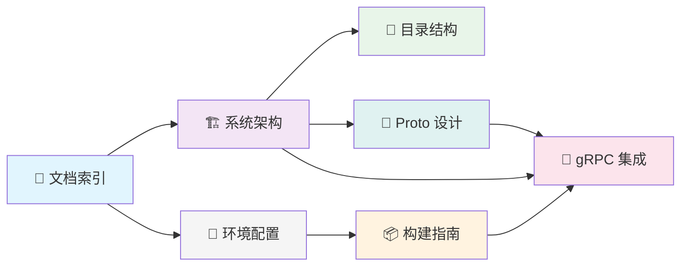

# AutoWeChat 技术文档

> 文档版本: v1.0 | 最后更新: 2026-06-20
>
> 相关文档导航:
> - [系统架构](system-architecture.md) — 分层设计、MVVM、线程模型、数据流
> - [目录结构](directory-structure.md) — 项目目录与各模块职责
> - [Proto 服务设计](proto-design.md) — gRPC 服务定义、消息结构
> - [gRPC 集成方案](grpc-integration.md) — CompletionQueue、双向流、回调桥接
> - [构建指南](build-guide.md) — CMake 配置、依赖、编译步骤
> - [环境配置](environment-setup.md) — IDE、Qt 安装、工具链

---

## 项目简介

AutoWeChat 是一个使用 **Qt6 QML + C++ + gRPC** 复刻微信的学习项目，核心目标是深度学习 C++ 多线程编程和网络编程。项目采用前后端分离架构：

- **前端**：Qt6 QML GUI 客户端（MVVM 模式），负责界面展示与用户交互
- **后端**：Qt6 QCoreApplication headless 服务端，负责业务逻辑与数据持久化
- **共享层**：日志库等前后端公用代码
- **Proto 层**：Protocol Buffers 服务定义（gRPC 通信契约）

## 技术栈

| 层 | 技术 | 用途 |
|---|------|------|
| 前端 UI | Qt 6.10 QML (Quick Controls) | 声明式 UI |
| 前端逻辑 | C++17 ViewModels (MVVM) | Q_PROPERTY 绑定 QML |
| 通信协议 | gRPC + Protocol Buffers | 前后端 RPC 通信 |
| 后端平台 | Qt6 QCoreApplication | 无头进程，复用 QSqlDatabase、QThreadPool |
| 数据库 | SQLite (Phase 1) | 零配置，单文件 |
| 构建系统 | CMake 3.21+ | 跨平台构建 |
| 编译器 | MSVC 2022 | Windows 原生编译 |

## 文档依赖关系



**图1 文档依赖关系图**：该图展示了各文档之间的前置依赖关系。索引是入口，系统架构是核心枢纽，Proto 设计和目录结构依赖架构决策。gRPC 集成方案依赖 Proto 设计和构建指南。阅读建议：从上到下、从左到右。

## 快速开始

```bash
# 1. 配置 CMake
cmake --preset windows-msvc2022-debug

# 2. 构建前端客户端
cmake --build build/windows-msvc2022-debug --config Debug --target WeChatClient --parallel

# 3. 构建后端服务端
cmake --build build/windows-msvc2022-debug --config Debug --target WeChatServer --parallel

# 4. 运行客户端
./build/windows-msvc2022-debug/frontend/src/app/Debug/WeChatClient.exe

# 5. 运行服务端
./build/windows-msvc2022-debug/backend/src/Debug/WeChatServer.exe
```

## 实施阶段

| Phase | 内容 | 状态 |
|-------|------|------|
| Phase 0 | 修复文件结构与 CMake 配置 | 已完成 |
| Phase 1 | 登录 + 联系人 + 一对一文字聊天 | 待实现 |
| Phase 2 | 群聊 + 文件传输 | 规划中 |
| Phase 3 | 朋友圈 + 音视频通话 | 规划中 |
