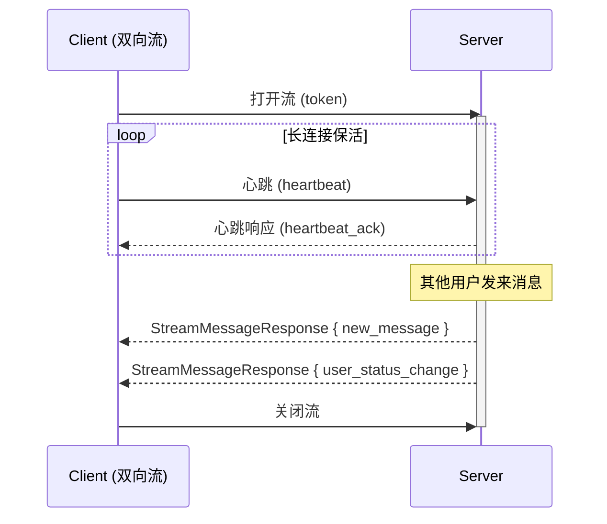

# Proto 服务设计

> 文档版本: v1.1 | 最后更新: 2026-06-21
>
> 相关文档导航:
> - [文档索引](index.md) — 项目概述、文档依赖关系
> - [需求分析](requirements-analysis.md) — 功能需求、用例图
> - [系统架构](system-architecture.md) — 分层设计、线程模型
> - [后端设计](backend-design.md) — ER图、Service接口
> - [gRPC 集成方案](grpc-integration.md) — 客户端/服务端实现
> - [环境配置](environment-setup.md) — IDE、构建命令

---

## 一、服务总览

AutoWeChat 定义了 4 个 gRPC 服务，覆盖微信核心功能的通信契约。

> gRPC 桩代码已通过 `proto/CMakeLists.txt` 自动生成（`protoc` + `grpc_cpp_plugin`），生成的 `.pb.h/.pb.cc` 和 `.grpc.pb.h/.grpc.pb.cc` 打包为 `wechat_proto` 静态库。

| 服务 | Proto 文件 | RPC 方法 | 通信模式 | Phase |
|------|-----------|---------|---------|-------|
| `AuthService` | `auth.proto` | Login, Register, Logout, ValidateToken | 一元调用 | Phase 1 |
| `ChatService` | `chat.proto` | SendMessage, StreamMessages, GetHistory | 一元 + 双向流 | Phase 1 |
| `ContactService` | `contact.proto` | GetContacts, AddContact, DeleteContact, SearchUsers | 一元调用 | Phase 1 |
| `GroupService` | 待定义 | 群聊相关 | — | Phase 2 |

## 二、基础类型（common.proto）

```protobuf
syntax = "proto3";
package wechat;

message User {
  string user_id = 1;
  string username = 2;
  string nickname = 3;
  string avatar_url = 4;
  int32 status = 5;       // 0=offline, 1=online, 2=away
}

message TextMessage {
  string message_id = 1;
  string sender_id = 2;
  string receiver_id = 3;
  string content = 4;
  int64 timestamp_ms = 5;
  int32 message_type = 6;  // 0=text, 1=image, 2=file
}
```

`User` 和 `TextMessage` 是所有服务的公共数据类型，被其他 proto 文件通过 `import "common.proto"` 引用。

## 三、AuthService —— 认证服务

### 3.1 服务定义

```protobuf
service AuthService {
  rpc Login(LoginRequest) returns (LoginResponse);
  rpc Register(RegisterRequest) returns (RegisterResponse);
  rpc Logout(LogoutRequest) returns (LogoutResponse);
  rpc ValidateToken(ValidateTokenRequest) returns (ValidateTokenResponse);
}
```

### 3.2 RPC 详细说明

#### Login

| 属性 | 值 |
|------|-----|
| 模式 | 一元调用 (Unary) |
| 用途 | 用户登录，返回 Token |

| 字段 | 类型 | 说明 |
|------|------|------|
| **请求** | | |
| username | string | 用户名 |
| password_hash | string | 密码哈希值 |
| **响应** | | |
| success | bool | 是否成功 |
| token | string | 会话 Token |
| error_message | string | 错误信息 |
| user | User | 用户信息 |

#### Register

| 属性 | 值 |
|------|-----|
| 模式 | 一元调用 |
| 用途 | 新用户注册 |

| 字段 | 类型 | 说明 |
|------|------|------|
| username | string | 用户名（唯一） |
| nickname | string | 昵称 |
| password_hash | string | 密码哈希值 |

#### Logout / ValidateToken

- `Logout`：使 Token 失效，请求携带 token，返回 success
- `ValidateToken`：验证 Token 有效性，返回 valid + user_id

## 四、ChatService —— 聊天服务

### 4.1 服务定义

```protobuf
service ChatService {
  rpc SendMessage(SendMessageRequest) returns (SendMessageResponse);
  rpc StreamMessages(stream StreamMessageRequest) returns (stream StreamMessageResponse);
  rpc GetHistory(GetHistoryRequest) returns (GetHistoryResponse);
}
```

### 4.2 SendMessage —— 发送消息（一元调用）

| 字段 | 类型 | 说明 |
|------|------|------|
| **请求** | | |
| token | string | 会话 Token |
| receiver_id | string | 接收者 ID |
| content | string | 消息内容 |
| message_type | int32 | 0=text, 1=image, 2=file |
| **响应** | | |
| success | bool | 是否成功 |
| message_id | string | 服务端生成的消息 ID |
| server_timestamp_ms | int64 | 服务端时间戳 |
| error_message | string | 错误信息 |

### 4.3 StreamMessages —— 实时消息推送（双向流）

这是整个系统最关键的 RPC，用于实现微信的实时消息推送。



**图1 双向流通信时序图**：该图展示了 StreamMessages 双向流的工作流程。客户端登录后打开流并定期发送心跳保活。当其他用户向当前用户发送消息时，服务端通过同一个流主动推送消息。服务端也会推送联系人状态变更事件。

**StreamMessageResponse 使用 oneof 区分消息类型**：

| oneof 变体 | 触发条件 | 内容 |
|-----------|---------|------|
| `new_message` | 收到新消息 | TextMessage |
| `heartbeat_ack` | 心跳响应 | int32 |
| `user_status_change` | 联系人上线/下线 | "userId:online" / "userId:offline" |

### 4.4 GetHistory —— 获取历史消息（一元调用）

| 字段 | 类型 | 说明 |
|------|------|------|
| **请求** | | |
| token | string | 会话 Token |
| peer_user_id | string | 对方用户 ID |
| before_timestamp_ms | int64 | 拉取此时间之前的消息（分页游标） |
| limit | int32 | 每页条数 |
| **响应** | | |
| messages | repeated TextMessage | 消息列表 |
| has_more | bool | 是否还有更多 |

## 五、ContactService —— 联系人服务

### 5.1 服务定义

```protobuf
service ContactService {
  rpc GetContacts(GetContactsRequest) returns (GetContactsResponse);
  rpc AddContact(AddContactRequest) returns (AddContactResponse);
  rpc DeleteContact(DeleteContactRequest) returns (DeleteContactResponse);
  rpc SearchUsers(SearchUsersRequest) returns (SearchUsersResponse);
}
```

### 5.2 接口概览

| RPC 方法 | 对应需求 | 说明 |
|---------|---------|------|
| GetContacts | FR-CONTACT-001 | 获取当前用户的所有联系人列表 |
| AddContact | FR-CONTACT-002 | 添加联系人，可附带备注 |
| DeleteContact | FR-CONTACT-003 | 删除联系人 |
| SearchUsers | FR-CONTACT-004 | 按关键字搜索用户（用于添加联系人时查找） |

## 六、安全设计

### 6.1 Token 认证

所有需要登录态的 RPC 请求头都携带 `token` 字段。后端 `SessionManager` 负责 Token 的创建、验证和失效。

```mermaid
flowchart TD
    START(["客户端发起 RPC"]) --> CHECK{"请求含 Token?"}
    CHECK -->|是| VALIDATE["SessionManager::validateSession()"]
    CHECK -->|否| PUBLIC{"公开接口?"}
    PUBLIC -->|是 (Login/Register)| EXEC["执行业务逻辑"]
    PUBLIC -->|否| DENY(["返回 UNAUTHENTICATED"])
    VALIDATE -->|有效| EXEC
    VALIDATE -->|失效| DENY
    EXEC --> END(["返回响应"])
```

**图2 Token 认证流程图**：该图展示了 gRPC 请求的认证流程。每个请求携带 Token，后端通过 SessionManager 验证其有效性。Login 和 Register 是公开接口，不需要 Token。其他所有 RPC 都需要有效 Token 才能访问。

### 6.2 密码安全

- 客户端传输密码哈希值（而非明文）
- 服务端存储 bcrypt/scrypt 哈希（加盐）
- Token 设置过期时间（默认 24 小时）
