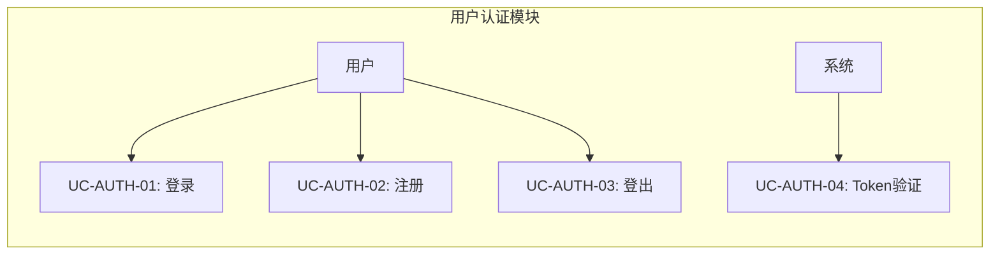
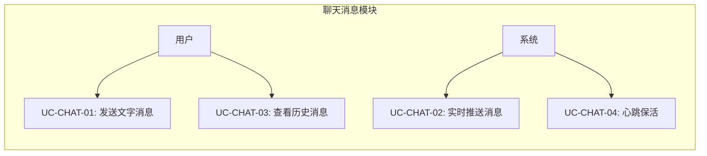
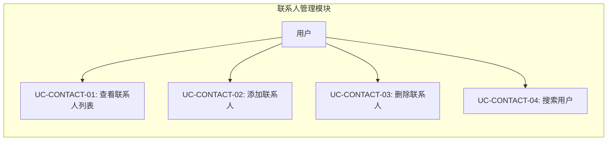

# 需求分析

> 文档版本: v1.1 | 最后更新: 2026-06-21
>
> 相关文档导航:
> - [文档索引](index.md) — 项目概述、文档依赖关系
> - [系统架构](system-architecture.md) — 分层设计、线程模型
> - [前端设计](frontend-design.md) — 组件树、MVVM 交互
> - [后端设计](backend-design.md) — ER图、Service接口
> - [Proto 服务设计](proto-design.md) — gRPC 服务定义
> - [gRPC 集成方案](grpc-integration.md) — 客户端/服务端实现
> - [测试指南](testing-guide.md) — 测试策略、覆盖矩阵
> - [环境配置](environment-setup.md) — IDE、构建命令

---

## 一、项目背景与目标

AutoWeChat 是一个使用 **Qt6 QML + C++ + gRPC** 复刻微信桌面应用的学习项目，核心目标是深度学习 C++ 多线程编程和网络编程。

**目标**：
- 实现微信核心功能：登录注册、联系人管理、一对一文字聊天
- 掌握 gRPC 双向流通信、CompletionQueue 异步模型
- 实践 Qt 多线程编程（QThread、QThreadPool、QMetaObject::invokeMethod）
- 实践 MVVM 架构在 Qt/QML 中的落地

## 二、用户角色定义

| 角色 | 说明 |
|------|------|
| **普通用户** | 注册账号、登录、管理联系人、发送接收消息 |
| **系统** | 自动推送消息、管理在线状态、维护会话 |

## 三、功能需求表

### 3.1 用户认证

| 编号 | 功能名称 | 优先级 | 描述 | 验收条件 | Phase |
|------|---------|--------|------|---------|-------|
| FR-AUTH-001 | 用户注册 | P0 | 新用户填写用户名、昵称、密码完成注册 | 注册成功后返回 Token，可登录 | Phase 1 |
| FR-AUTH-002 | 用户登录 | P0 | 已注册用户通过用户名+密码登录 | 输入正确凭据返回 Token，跳转主页 | Phase 1 |
| FR-AUTH-003 | 用户登出 | P0 | 已登录用户主动退出登录 | Token 失效，跳转登录页 | Phase 1 |
| FR-AUTH-004 | Token 验证 | P0 | 服务端验证客户端携带的 Token 有效性 | 无效 Token 返回 UNAUTHENTICATED | Phase 1 |

### 3.2 聊天消息

| 编号 | 功能名称 | 优先级 | 描述 | 验收条件 | Phase |
|------|---------|--------|------|---------|-------|
| FR-CHAT-001 | 发送文字消息 | P0 | 用户选择联系人后发送文字消息 | 消息送达接收者，显示发送时间 | Phase 1 |
| FR-CHAT-002 | 接收实时消息 | P0 | 在线时实时接收其他用户发来的消息 | 消息通过双向流推送，无延迟显示 | Phase 1 |
| FR-CHAT-003 | 获取历史消息 | P1 | 进入聊天界面时加载历史消息记录 | 支持分页加载，按时间倒序 | Phase 1 |
| FR-CHAT-004 | 心跳保活 | P0 | 客户端与服务端保持长连接心跳 | 30 秒间隔心跳，连续 3 次丢失后重连 | Phase 1 |

### 3.3 联系人管理

| 编号 | 功能名称 | 优先级 | 描述 | 验收条件 | Phase |
|------|---------|--------|------|---------|-------|
| FR-CONTACT-001 | 获取联系人列表 | P0 | 查看当前用户的所有联系人及其在线状态 | 列表随在线状态实时更新 | Phase 1 |
| FR-CONTACT-002 | 添加联系人 | P0 | 通过搜索用户名添加联系人 | 添加成功后出现在联系人列表 | Phase 1 |
| FR-CONTACT-003 | 删除联系人 | P1 | 从联系人列表中删除指定用户 | 删除后对方列表中也不再显示 | Phase 1 |
| FR-CONTACT-004 | 搜索用户 | P1 | 按关键字搜索平台用户 | 返回匹配的用户列表 | Phase 1 |

### 3.4 群聊（Phase 2）

| 编号 | 功能名称 | 优先级 | 描述 | 验收条件 | Phase |
|------|---------|--------|------|---------|-------|
| FR-GROUP-001 | 创建群聊 | P1 | 用户创建群组并邀请成员 | 群组创建成功，成员收到通知 | Phase 2 |
| FR-GROUP-002 | 群消息发送 | P1 | 在群组中发送消息，所有成员可见 | 所有在线成员实时收到消息 | Phase 2 |
| FR-GROUP-003 | 群成员管理 | P2 | 群主添加/移除群成员 | 变更实时通知所有群成员 | Phase 2 |

### 3.5 朋友圈（Phase 3）

| 编号 | 功能名称 | 优先级 | 描述 | 验收条件 | Phase |
|------|---------|--------|------|---------|-------|
| FR-MOMENTS-001 | 发布朋友圈 | P2 | 用户发布图文动态 | 联系人可见 | Phase 3 |
| FR-MOMENTS-002 | 浏览朋友圈 | P2 | 查看联系人的动态时间线 | 按时间倒序展示 | Phase 3 |
| FR-MOMENTS-003 | 点赞/评论 | P2 | 对朋友圈动态点赞或评论 | 作者收到通知 | Phase 3 |

**优先级定义**：
- **P0**：核心功能，不实现则系统不可用
- **P1**：重要功能，推荐在 MVP 中实现
- **P2**：增强功能，可在后续迭代中添加

## 四、用例图

### 4.1 用户认证用例

**图1 用户认证用例图**：该图展示了用户与系统在认证模块中的交互能力。用户可以注册账号、登录获取 Token、主动登出。系统后台自动进行 Token 有效性验证，无效 Token 将拒绝后续请求。

### 4.2 聊天消息用例

**图2 聊天消息用例图**：该图展示了聊天消息模块的核心用例。用户主动发送消息和查看历史记录。系统通过双向流实时推送消息，并通过心跳机制维护长连接，确保消息及时送达。

### 4.3 联系人管理用例

**图3 联系人管理用例图**：该图展示了联系人管理模块的核心用例。用户可以查看联系人列表（含在线状态）、通过搜索添加联系人、删除已有联系人。

## 五、非功能需求

| 编号 | 类别 | 描述 |
|------|------|------|
| NFR-001 | 性能 | gRPC 一元调用延迟 < 100ms（局域网） |
| NFR-002 | 性能 | 消息实时推送延迟 < 500ms |
| NFR-003 | 可靠性 | 心跳断开后 90 秒内自动重连 |
| NFR-004 | 安全性 | 密码传输使用哈希，不传输明文 |
| NFR-005 | 安全性 | Token 支持过期机制（默认 24 小时） |
| NFR-006 | 兼容性 | 仅支持 Windows 10/11 x64 |
| NFR-007 | 可维护性 | 所有关键代码包含中文注释 |
| NFR-008 | 可测试性 | CMake CTest 集成，支持一键构建测试 |

## 六、验收标准（按 Phase）

| Phase | 验收标准 |
|-------|---------|
| **Phase 0** | CMake 构建通过（frontend + backend + proto），gRPC 静态库集成，文档体系完整 |
| **Phase 1** | 用户可注册/登录/登出，添加/删除联系人，发送/接收文字消息，历史消息分页加载 |
| **Phase 2** | 群聊创建与消息，文件传输 |
| **Phase 3** | 朋友圈发布与浏览，音视频通话 |

## 七、需求追溯矩阵

| 需求编号 | 用例 | 系统组件 | 后端接口 | 前端页面 | 测试用例 |
|---------|------|---------|---------|---------|---------|
| FR-AUTH-001 | UC-AUTH-02 | AuthService | AuthService/Register | RegisterPage | TC-AUTH-001 |
| FR-AUTH-002 | UC-AUTH-01 | AuthService | AuthService/Login | LoginPage | TC-AUTH-002 |
| FR-AUTH-003 | UC-AUTH-03 | AuthService | AuthService/Logout | — | TC-AUTH-003 |
| FR-AUTH-004 | UC-AUTH-04 | SessionManager | 拦截器级 | — | TC-AUTH-004 |
| FR-CHAT-001 | UC-CHAT-01 | ChatService | ChatService/SendMessage | ChatPage | TC-CHAT-001 |
| FR-CHAT-002 | UC-CHAT-02 | ChatService | ChatService/StreamMessages | ChatPage | TC-CHAT-002 |
| FR-CHAT-003 | UC-CHAT-03 | ChatService | ChatService/GetHistory | ChatPage | TC-CHAT-003 |
| FR-CHAT-004 | UC-CHAT-04 | ChatService | ChatService/StreamMessages | — | TC-CHAT-004 |
| FR-CONTACT-001 | UC-CONTACT-01 | ContactService | ContactService/GetContacts | ContactListPage | TC-CONTACT-001 |
| FR-CONTACT-002 | UC-CONTACT-02 | ContactService | ContactService/AddContact | AddContactPage | TC-CONTACT-002 |
| FR-CONTACT-003 | UC-CONTACT-03 | ContactService | ContactService/DeleteContact | — | TC-CONTACT-003 |
| FR-CONTACT-004 | UC-CONTACT-04 | ContactService | ContactService/SearchUsers | SearchUserPage | TC-CONTACT-004 |

> **说明**：测试用例编号为规划，具体测试用例将在 Phase 1 功能实现时编写，详见 [测试指南](testing-guide.md)。
