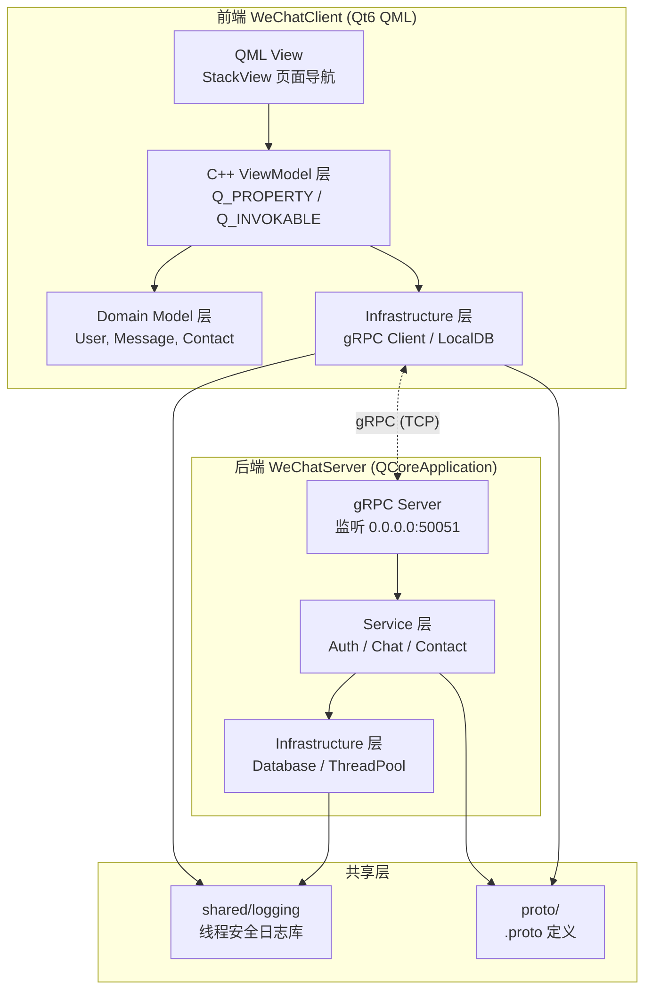
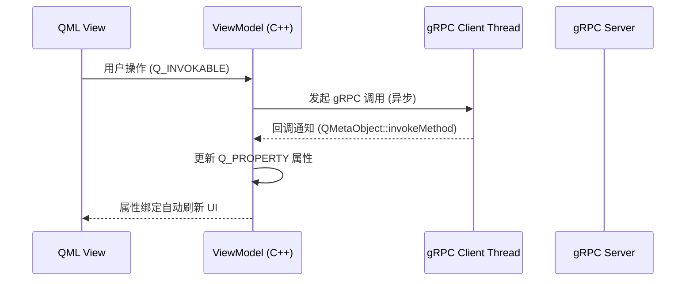
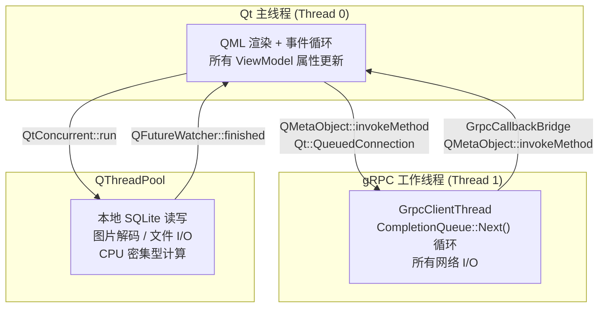
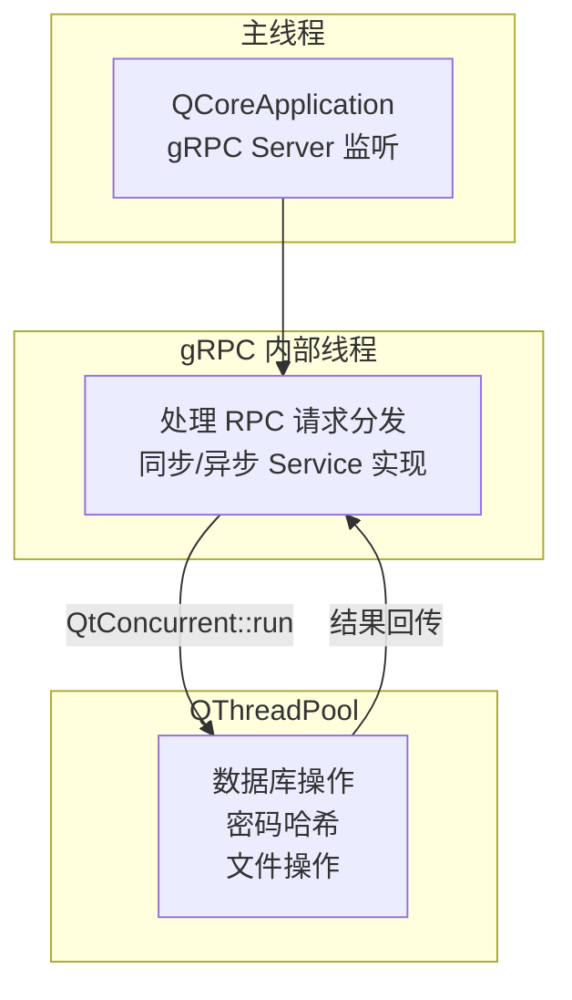
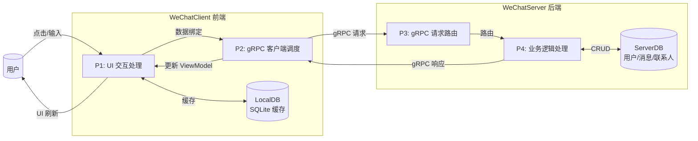

# 系统架构

> 文档版本: v1.0 | 最后更新: 2026-06-20
>
> 相关文档导航:
> - [文档索引](index.md) — 项目概述、技术栈
> - [目录结构](directory-structure.md) — 项目目录与模块职责
> - [Proto 服务设计](proto-design.md) — gRPC 服务定义
> - [gRPC 集成方案](grpc-integration.md) — 客户端/服务端实现
> - [构建指南](build-guide.md) — 编译步骤

---

## 一、系统架构概览

AutoWeChat 采用 **前后端分离 + MVVM 分层** 架构。前端为 Qt6 QML GUI 桌面应用，后端为 headless QCoreApplication 服务端，两者通过 gRPC 协议通信。

**图2 系统架构总览**：该图展示了 AutoWeChat 的四层分布式架构。前端遵循 MVVM 模式，QML 通过 Q_PROPERTY 和 Q_INVOKABLE 与 ViewModel 交互。后端为无头 QCoreApplication 进程，通过 gRPC Server 对外暴露服务。共享日志库被前后端同时链接，proto 定义作为前后端通信契约。

## 二、MVVM 分层设计（前端）

### 2.1 分层职责

| 层 | 目录 | 职责 | 依赖方向 |
|----|------|------|---------|
| **View** | `frontend/src/qml/` | QML 声明式 UI，StackView 页面导航，数据绑定 | → ViewModel |
| **ViewModel** | `frontend/src/app/viewmodel/` | Q_PROPERTY 暴露数据，Q_INVOKABLE 暴露操作，协调 Model 和 View | → Model, Infrastructure |
| **Model** | `frontend/src/domain/model/` | 纯数据结构（User, Message, Contact），不含业务逻辑 | — |
| **Infrastructure** | `frontend/src/infrastructure/` | gRPC 客户端、本地数据库、网络监控 | — |

### 2.2 MVVM 数据流

**图3 MVVM 数据流时序图**：该图展示了从前端用户操作到后端服务响应的完整数据流。用户操作通过 Q_INVOKABLE 触发 ViewModel 方法，ViewModel 异步发起 gRPC 调用到专用线程。响应通过 QMetaObject::invokeMethod 安全回主线程，更新 Q_PROPERTY 后 QML 自动刷新。

## 三、多线程模型

### 3.1 前端线程模型

**图4 前端线程模型**：该图展示了前端的 3 个线程池设计。主线程负责 QML 渲染和所有 ViewModel 操作，gRPC 线程运行 CompletionQueue 处理网络 I/O，QThreadPool 处理本地任务。跨线程通信统一使用 QMetaObject::invokeMethod + Qt::QueuedConnection，保证线程安全。

### 3.2 后端线程模型

**图5 后端线程模型**：该图展示了后端的线程架构。主线程运行 QCoreApplication 事件循环和 gRPC Server 监听。gRPC 内部线程池处理 RPC 请求分发。业务逻辑中的数据库操作和 CPU 密集型任务提交到 QThreadPool 异步执行。

### 3.3 线程安全规则

| 场景 | 机制 | 说明 |
|------|------|------|
| Worker → Main 回调 | `QMetaObject::invokeMethod(receiver, func, Qt::QueuedConnection)` | gRPC 响应 → ViewModel 更新 |
| Main → Worker 派发 | `QMetaObject::invokeMethod(worker, func, Qt::QueuedConnection)` | 用户操作 → gRPC 调用 |
| 共享数据保护 | `QMutex` + `QMutexLocker` | 日志条目、Session 管理 |
| 读多写少保护 | `QReadWriteLock` | 联系人列表缓存 |
| 一次性异步任务 | `QtConcurrent::run()` + `QFutureWatcher` | 图片加载、文件哈希 |
| 数据库连接 | 每线程独立 `QSqlDatabase` 连接 | SQLite 线程安全要求 |

## 四、数据流图（0 层 DFD）

**图6 0 层数据流图**：该图展示了从用户输入到后端数据存储再返回 UI 的完整数据流。前端通过本地 SQLite 缓存减少网络请求，gRPC 作为前后端唯一的通信通道。后端 Service 层负责业务逻辑编排，Repository 层执行数据持久化。

## 五、gRPC 通信模式

| 模式 | RPC 方法 | 用途 |
|------|---------|------|
| 一元调用 (Unary) | `Login`, `Register`, `SendMessage`, `GetContacts` | 请求-响应式操作 |
| 双向流 (Bidi Streaming) | `StreamMessages` | 实时消息推送 + 心跳保活 |
| 服务端流 (Server Streaming) | `GetHistory`（可选） | 批量拉取历史消息 |

## 六、技术选型依据

| 决策 | 选择 | 原因 |
|------|------|------|
| 前端框架 | Qt6 QML | 声明式 UI，原生性能，C++ 深度集成 |
| 通信协议 | gRPC | 强类型契约，内置流式传输，跨语言 |
| 后端平台 | Qt6 QCoreApplication | 复用 QSqlDatabase、QThreadPool 等 Qt 基础设施 |
| 数据库 | SQLite | 零配置，单文件，适合学习项目 |
| 构建系统 | CMake 3.21+ | Qt6 官方推荐，跨平台 |
| 依赖管理 | 手动集成第三方 | 学习依赖构建流程，避免 vcpkg 黑盒 |
