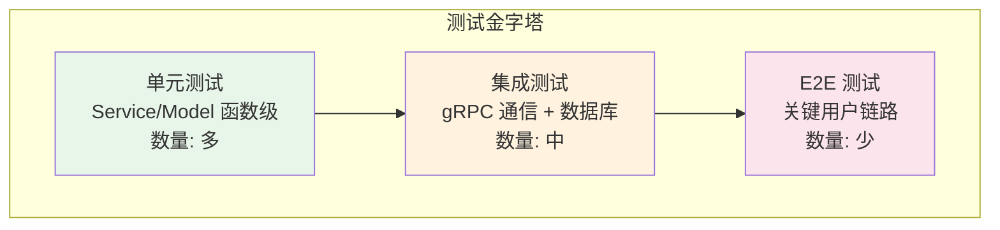

# 测试指南

> 文档版本: v1.1 | 最后更新: 2026-06-21
>
> 相关文档导航:
> - [文档索引](index.md) — 项目概述、文档依赖关系
> - [需求分析](requirements-analysis.md) — 功能需求、需求追溯矩阵
> - [系统架构](system-architecture.md) — 分层设计、线程模型
> - [前端设计](frontend-design.md) — 组件树、MVVM 交互
> - [后端设计](backend-design.md) — ER图、Service接口
> - [环境配置](environment-setup.md) — IDE、构建命令

---

## 模块导航

本文档是测试核心文档。以下测试用例覆盖各功能模块（待 Phase 1 实现时编写）：

| 模块 | 测试文档章节 | 说明 |
|------|-------------|------|
| **用户认证** | §3.2 | 单元测试 4 项，集成测试 2 项 |
| **聊天消息** | §3.3 | 单元测试 4 项，集成测试 2 项 |
| **联系人管理** | §3.4 | 单元测试 4 项，集成测试 2 项 |

---

## 一、测试策略

### 1.1 测试金字塔



**图1 测试金字塔**：该图展示三层测试策略。单元测试覆盖核心业务逻辑（Service 方法、数据模型），数量最多。集成测试验证 gRPC 通信和数据库交互。E2E 测试覆盖关键用户链路（登录→发送消息→登出）。目标比例：70% 单元 / 20% 集成 / 10% E2E。

### 1.2 测试环境与工具

| 工具 | 用途 |
|------|------|
| Qt6::Test | Qt 测试框架（QTestLib），单元测试和集成测试 |
| CMake CTest | 测试编排和运行 |
| gRPC InProcessChannel | 集成测试中避免网络依赖的进程内 gRPC 通道 |
| SQLite :memory: | 测试用内存数据库，每个测试用例独立实例 |

**已实现的测试基础设施**：
- `frontend/tests/CMakeLists.txt` — WeChatClientTests 脚手架 ✅
- `backend/tests/CMakeLists.txt` — WeChatServerTests 脚手架 ✅
- 根 CMake `BUILD_TESTS` 选项 — 控制测试编译 ✅
- `cmake --preset windows-msvc2022-debug -DBUILD_TESTS=ON` — 开启测试构建 ✅

## 二、单元测试

### 2.1 覆盖范围

单元测试聚焦于 Domain 层和 Service 层的纯逻辑，不依赖网络或数据库。

**待测组件**：
- 后端 Service 方法（AuthServiceImpl::Login、ChatServiceImpl::SendMessage 等）
- SessionManager（Token 创建/验证/失效）
- 数据模型（User、Message、Contact 结构化字段）
- LoggerService（日志缓冲、文件轮转）

### 2.2 测试用例表

#### 用户认证

| 编号 | 测试场景 | 前置条件 | 步骤 | 预期结果 | 覆盖需求 | 覆盖设计 |
|------|---------|---------|------|---------|---------|---------|
| TC-AUTH-001 | 注册成功 | 用户名未注册 | 提供合法 username/nickname/password_hash | 返回 Token + User | FR-AUTH-001 | backend-§5.1 |
| TC-AUTH-002 | 注册-用户名已存在 | 用户名已注册 | 提供已存在的 username | 返回 ALREADY_EXISTS | FR-AUTH-001 | backend-§5.1 |
| TC-AUTH-003 | 登录成功 | 用户已注册 | 提供正确的 username + password_hash | 返回 Token + User，status=online | FR-AUTH-002 | backend-§5.1 |
| TC-AUTH-004 | 登录-密码错误 | 用户已注册 | 提供错误的 password_hash | 返回 UNAUTHENTICATED | FR-AUTH-002 | backend-§5.1 |
| TC-AUTH-005 | Token 验证-有效 | 有效 Token 存在且未过期 | validateSession(token) | 返回 true + userId | FR-AUTH-004 | backend-§5.2 |
| TC-AUTH-006 | Token 验证-过期 | Token 已过期 | validateSession(token) | 返回 false | FR-AUTH-004 | backend-§5.2 |

#### 聊天消息

| 编号 | 测试场景 | 前置条件 | 步骤 | 预期结果 | 覆盖需求 | 覆盖设计 |
|------|---------|---------|------|---------|---------|---------|
| TC-CHAT-001 | 发送消息成功 | 发送者和接收者均存在 | SendMessage(valid_req) | 返回 message_id + timestamp | FR-CHAT-001 | backend-§5.1 |
| TC-CHAT-002 | 发送消息-接收者不存在 | 接收者 user_id 无效 | SendMessage(invalid_receiver) | 返回 NOT_FOUND | FR-CHAT-001 | backend-§5.1 |
| TC-CHAT-003 | 获取历史-有消息 | 存在历史聊天记录 | GetHistory(peer, before, limit) | 返回 messages[limit] + has_more=true | FR-CHAT-003 | backend-§5.1 |
| TC-CHAT-004 | 获取历史-无更多 | 消息总数 < limit | GetHistory(peer, before=0, limit=50) | 返回 messages[N] + has_more=false | FR-CHAT-003 | backend-§5.1 |

#### 联系人管理

| 编号 | 测试场景 | 前置条件 | 步骤 | 预期结果 | 覆盖需求 | 覆盖设计 |
|------|---------|---------|------|---------|---------|---------|
| TC-CONTACT-001 | 获取联系人列表 | 用户已登录且有联系人 | GetContacts(token) | 返回 contacts[] | FR-CONTACT-001 | backend-§5.1 |
| TC-CONTACT-002 | 添加联系人成功 | 目标用户存在 | AddContact(token, targetId) | 返回 success=true | FR-CONTACT-002 | backend-§5.1 |
| TC-CONTACT-003 | 删除联系人 | 联系人关系存在 | DeleteContact(token, targetId) | 返回 success=true | FR-CONTACT-003 | backend-§5.1 |
| TC-CONTACT-004 | 搜索用户 | 存在匹配用户 | SearchUsers(keyword, limit=10) | 返回 1-10 个匹配 User | FR-CONTACT-004 | backend-§5.1 |

> **注意**：上述测试用例为规划。当前 Phase 0 暂无功能代码，测试将在 Phase 1 功能实现时编写。

## 三、集成测试

### 3.1 覆盖范围

集成测试使用 gRPC InProcessChannel 进行进程内通信，使用 SQLite :memory: 数据库，避免外部依赖。

**测试目标**：
- gRPC 服务端-客户端完整调用链路
- 数据库 CRUD 操作与 Service 层集成
- SessionManager + Token 认证完整流程
- 双向流消息推送端到端

### 3.2 测试用例表

| 编号 | 场景 | 涉及模块 | 步骤 | 预期结果 | 覆盖需求 |
|------|------|---------|------|---------|---------|
| TC-INT-101 | 注册→登录完整流程 | AuthService → SessionManager → DB | 注册新用户 → 用相同凭据登录 | 两次调用均成功，登录返回有效 Token | FR-AUTH-001, FR-AUTH-002 |
| TC-INT-102 | 发送消息→接收者实时收到 | ChatService → SessionManager | A 通过双向流连接 → B 向 A 发送消息 | A 的流收到 new_message 推送 | FR-CHAT-001, FR-CHAT-002 |
| TC-INT-103 | 心跳保活-超时重连 | ChatService → StreamMessages | 开启流 → 停止发送心跳 → 等待超时 | 客户端检测到断连并自动重连 | FR-CHAT-004 |
| TC-INT-104 | 添加联系人-双向可见 | ContactService → DB | A 添加 B → 检查 A 和 B 的联系人列表 | A 列表中含 B，B 列表中含 A | FR-CONTACT-002, FR-CONTACT-001 |

> **注意**：上述集成测试用例为规划。当前 Phase 0 暂无功能代码。

## 四、端到端测试

### 4.1 关键用户链路

| 编号 | 链路 | 覆盖模块 |
|------|------|---------|
| TC-E2E-201 | 注册 → 登录 → 搜索用户 → 添加联系人 → 发送消息 → 接收消息 → 查看历史 → 登出 | Auth + Contact + Chat |
| TC-E2E-202 | 登录 → 断网 → 重连 → 消息补推 | Chat (双向流) |

### 4.2 E2E 测试说明

E2E 测试需要启动完整的 WeChatClient 和 WeChatServer 进程。当前 Phase 0 无前端交互页面，E2E 测试将在 Phase 1 实现基本 UI 后设计。

## 五、需求-设计-测试追溯矩阵

| 需求编号 | 设计文档章节 | 后端接口 | 前端页面 | 单元测试 | 集成测试 | E2E 测试 |
|---------|------------|---------|---------|---------|---------|---------|
| FR-AUTH-001 | backend-§5.1 | AuthService/Register | RegisterPage | TC-AUTH-001, TC-AUTH-002 | TC-INT-101 | TC-E2E-201 |
| FR-AUTH-002 | backend-§5.1 | AuthService/Login | LoginPage | TC-AUTH-003, TC-AUTH-004 | TC-INT-101 | TC-E2E-201 |
| FR-AUTH-003 | backend-§5.1 | AuthService/Logout | — | — | — | TC-E2E-201 |
| FR-AUTH-004 | backend-§5.2 | AuthService/ValidateToken | — | TC-AUTH-005, TC-AUTH-006 | — | — |
| FR-CHAT-001 | backend-§5.1 | ChatService/SendMessage | ChatPage | TC-CHAT-001, TC-CHAT-002 | TC-INT-102 | TC-E2E-201 |
| FR-CHAT-002 | backend-§5.1 | ChatService/StreamMessages | ChatPage | — | TC-INT-102 | TC-E2E-201 |
| FR-CHAT-003 | backend-§5.1 | ChatService/GetHistory | ChatPage | TC-CHAT-003, TC-CHAT-004 | — | TC-E2E-201 |
| FR-CHAT-004 | backend-§5.1 | ChatService/StreamMessages | — | — | TC-INT-103 | TC-E2E-202 |
| FR-CONTACT-001 | backend-§5.1 | ContactService/GetContacts | ContactListPage | TC-CONTACT-001 | — | TC-E2E-201 |
| FR-CONTACT-002 | backend-§5.1 | ContactService/AddContact | AddContactPage | TC-CONTACT-002 | TC-INT-104 | TC-E2E-201 |
| FR-CONTACT-003 | backend-§5.1 | ContactService/DeleteContact | — | TC-CONTACT-003 | — | — |
| FR-CONTACT-004 | backend-§5.1 | ContactService/SearchUsers | SearchUserPage | TC-CONTACT-004 | — | TC-E2E-201 |

> **说明**：标记 "—" 的单元格表示该需求在当前阶段没有对应层级的测试（如 FR-AUTH-003 登出操作不涉及复杂的单元测试逻辑）。

## 六、测试运行命令

```bash
# 1. 开启测试并配置
cmake --preset windows-msvc2022-debug -DBUILD_TESTS=ON

# 2. 构建全部测试聚合目标
cmake --build build/windows-msvc2022-debug --config Debug --target all_tests --parallel

# 3. 运行测试（含详细失败输出）
ctest --test-dir build/windows-msvc2022-debug -C Debug --output-on-failure
```

**当前状态**：测试框架已就绪，构建通过，但尚无实际测试用例（`frontend/tests/` 和 `backend/tests/` 为脚手架）。测试用例将在 Phase 1 功能实现时编写。
